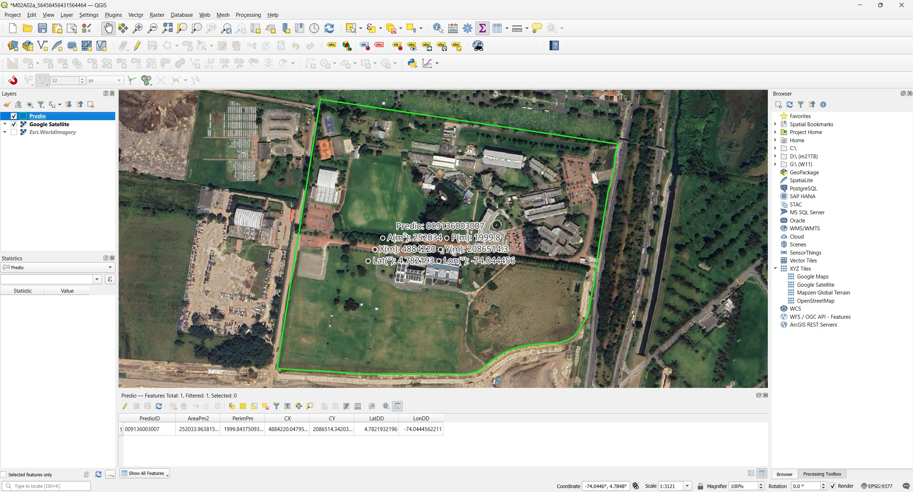

# Digitalización de campus
Keywords:  `shapefile` `new_layer` `land_index` `buffer` `point` `line` `polygon`

Bases de datos y su manejo en SIG. Definición de elementos de un SIG (shapes, raster, vectores, etc.). Edición de elementos. Digitalización y entrada de entidades.

**Caso de estudio**: digitalización y cálculo de índices de la Universidad Escuela Colombiana de Ingeniería Julio Garavito.

<div align="center"><sub><br><a href="https://www.google.com/maps/place/Colombian+School+of+Engineering+Julio+Garavito/@4.7829367,-74.0443354,566m">https://www.google.com/maps</a></sub><br><br></div>


## Objetivos

Al finalizar esta actividad, el estudiante:

* Comprende el uso de las bases de datos en SIG.
* Realiza ejercicios prácticos en los que define y edita elementos de un SIG.
* Utiliza Python para crear capas y agregar campos de atributos.
* Ejecuta herramientas de geo-procesamiento.


## Requerimientos

Archivos, actividades previas, lecturas y herramientas requeridas para el desarrollo de esta actividad:

<div align="center">

| Requerimiento                             | Descripción           |
|:------------------------------------------|:----------------------|
| [:toolbox:Herramienta](https://qgis.org/) | QGIS 3.44 o superior. |  

</div>


## 0. Conceptos generales de escala

Tomado o adaptado de: Lineamientos para el uso de información geográfica en el desarrollo del componente rural de los Planes de Ordenamiento Territorial, IGAC.[^1]

La escala (entendida como la relación existente entre la distancia en el terreno y su equivalente en el mapa) de la cartografía básica es un aspecto de gran relevancia a la hora de planear el ordenamiento del territorio, pues dependiendo de esta, es posible apreciar mayor o menor cantidad de elementos del paisaje. Así, a mayor escala (o más cerca), se aprecian más elementos y con mayor detalle, mientras que, a menor escala (o más lejos), la información será más general y con menor detalle.

La escala de la cartografía determina la forma y el tamaño en que se ven los elementos del paisaje. Un ejemplo claro de ello es la forma como se ven las construcciones. Cuando estas se representan en una escala general, se ven como puntos, y al aumentar la escala, las mismas aparecen como polígonos, siendo más grandes cuanto mayor es la escala.

<div align="center"><sub><br>Tomado de: <a href="../../ref/cartilla_pot.pdf">Concepto de escala. IGAC, 2019</a></sub><br><br></div>

La cartografía básica de Colombia creada por el [Instituto Geográfico Agustín Codazzi - IGAC](https://www.igac.gov.co/), puede ser descargada desde www.colombiaenmapas.com a nivel general en escalas 1:500000 (Precisión planimétrica de 1000m y altimétrica de 100m), 1:100000 (Precisión planimétrica de 200m y altimétrica de 50m) y por planchas a escala 1:25000 (Precisión planimétrica de 50m y altimétrica de 25m). 

<div align="center"></div>

Es de aclarar que, en el ámbito municipal, para el ejercicio del ordenamiento territorial, tradicionalmente se ha privilegiado el uso de cartografía a escala 1:25.000 para el sector rural y 1:5.000 o 1:2.000 en el sector urbano. Sin embargo, el IGAC recomienda que para la formulación y/o procesos de revisión y ajuste de los POT, la escala de la cartografía se defina en función de los procesos y dinámicas de cada territorio. En este sentido, se propone que para el suelo rural se contemplen factores como el área municipal, la pendiente, el tamaño de los predios, la densidad de la red hidrográfica y de la infraestructura vial, entre otros.

En la siguiente tabla se relaciona la escala ideal de trabajo recomendada a escala rural de acuerdo con las características mencionadas.

<div align="center">

| Escala    | Pendientes           | Densidad de la<br>red hidrográfica | Densidad de la infra-<br>estructura vial | Tamaño predios                    |
|-----------|----------------------|------------------------------------|------------------------------------------|-----------------------------------|
| 1:100.000 | Moderada: hasta 12%  | Baja: <3 km/km²                    | Baja: <3 km/km²                          | Latifundio: >200 Ha               |
| 1:25.000  | Montañosa: >12%      | Alta: >3 km/km²                    | Alta: >3 km/km²                          | Mediano a pequeño: De 10 a 200 Ha |
| 1:10.000  | Montañosa: >12%      | Alta: >3 km/km²                    | Alta: >3 km/km²                          | Minifundio: De 3 a 10 Ha          |
| 1:5.000   | Montañosa: >12%      | Alta: >3 km/km²                    | Alta: >3 km/km²                          | Microfundio: <3 Ha                |

</div>

Con base en la información de la tabla anterior, se recomienda que para el suelo rural de aquellos municipios localizados en las zonas montañosas, se utilice cartografía básica a escala 1:10.000 y para los ubicados sobre los valles interandinos y las costas Caribe y Pacífica, cartografía básica a escala 1:25.000. Por otro lado, para la mayoría de municipios del oriente del país, en donde existen características homogéneas de cobertura boscosa y territorios colectivos, se considera suficiente la cartografía a escala 1:100.000. 

Asimismo, teniendo en cuenta los factores mencionados en la anterior, se recomienda que para las áreas urbanas, de expansión urbana y centros poblados, se utilice información geográfica con escalas entre 1:1.000 y 1:5.000. Adicionalmente, para definir la escala, se deben tener en cuenta las dinámicas de urbanización y las relaciones del sistema de asentamientos, lo que permitirá un análisis detallado de la distribución de los procesos físicos, ambientales, y sociales que allí se presentan. Además, se debe contemplar la información catastral, de gran importancia y utilidad para el conocimiento de las estructuras y las dinámicas urbanas.


## 1. Instrucciones generales

Siga en clase las indicaciones del instructor y complete la digitalización teniendo en cuenta las siguientes directrices:

* Crear diferentes capas geográficas en formato shapefile utilizando el CRS 9377, digitalizar: predio, construcciones bajo cubierta, vías, arbolado y luminarias.
* Crear los campos de atributos indicados en la guía y poblar la tabla a partir de las observaciones realizadas a través de Google Street View, fotografías en Google Maps, en Google Earth o usando vídeos de apoyo. En las capturas de pantalla se deben observar las tablas de atributos pobladas para los atributos indicados.
* En el informe técnico, incluir capturas de pantalla con el procedimiento de creación de cada tabla, el proceso de digitalización y la capa final con la tabla de atributos completamente poblada.
* Para cada capa, crear un resumen estadístico y una gráfica de análisis, p. ej., número de construcciones por tipo de estructura. Incluir para cada capa capturas de pantalla donde se observen las tablas y gráficas de análisis.
* Se recomienda utilizar como referencia para digitalización, los mapas de Open Street Maps y las imágenes satelitales de Google Maps, Bing o ESRI. Por ejemplo, https://www.google.com/maps/@4.7832006,-74.0451788,17.71z
* Algunos edificios requieren de la digitalización de zonas semicirculares o arcos.
* Varias de las esquinas de las edificaciones están construidas a un ángulo de 90 grados, tenga en cuenta que debe conservar este ángulo en la digitalización.
* Para los índices solicitados, es necesario mostrar captura de pantalla de la herramienta GIS con la ventana del Calculador de Campo, donde se observe la operación realizada.
* Comprimir independientemente cada archivo de formas shapefile (_TSIG_Predio.shp, TSIG_Construccion.shp, TSIG_Vial.shp, TSIG_VialBuffer.shp, TSIG_Arbolado.shp, TSIG_ArboladoBuffer.shp, TSIG_Luminaria.shp, TSIG_LuminariaBuffer.shp_) y guardar en la carpeta /shp de su repositorio. Recuerde que un archivo de forma shapefile está compuesto por 4 archivos: .shp, .shx, .prj, .dbf.

> Para facilitar la edición y visualización, agregue el mapa base de Google Satellite desde el conector https://mt1.google.com/vt/lyrs=s&x={x}&y={y}&z={z}. Mapas base adicionales pueden ser agregados usando los enlaces contenidos en el repositorio https://github.com/opengeos/qgis-basemaps


## 2. Capas geográficas requeridas

Para cada capa requerida, cree archivos de formas geográficas shapefile (.shp). 


### 2.1. Predio o lote

Crear una capa tipo polígono en 2D para digitalizar el predio de la institución educativa, nombrar como `TSIG_Predio.shp`.

Atributos requeridos:

<div align="center">

| Campo    | Tipo         | Descripción                                                                                                                                                       |
|:---------|:-------------|:------------------------------------------------------------------------------------------------------------------------------------------------------------------|
| PredioID | String (200) | Consultar el catastro distrital o nacional y obtener el código CHIP o llave predial de este predio. Es necesario investigar y documentar el proceso de obtención. |
| AreaPm2  | Real (10)    | Área planar en m².<br>`area(@geometry)`                                                                                                                           |
| PerimPm  | Real (10)    | Perímetro planar en m.<br>`perimeter(@geometry)`                                                                                                                  |
| CX       | Real (10)    | Coordenada X del centroide en m.<br>`x(@geometry)`                                                                                                                |
| CY       | Real (10)    | Coordenada y del centroide en m.<br>`y(@geometry)`                                                                                                                |
| LatDD    | Real (10)    | Latitud del centroide en grados geodésicos °.<br>`y(transform(@geometry, layer_property(@layer, 'crs'),'EPSG:4326'))`                                             |
| LonDD    | Real (10)    | Longitud del centroide en grados geodésicos °.<br>`x(transform(@geometry, layer_property(@layer, 'crs'),'EPSG:4326'))`                                            |

</div>

> Tenga en cuenta que en un archivo de formas Shapefile (.shp), los nombres de los campos de atributos no pueden contener más de 10 caracteres. 

Fuentes de datos para obtención de predios y/o lotes:

* Predios Bogotá D.C.: https://mapas.bogota.gov.co
* Predios Bogotá D.C.: https://www.ideca.gov.co/recursos/mapas/predios-bogota-dc
* Predios Bogotá D.C.: https://datosabiertos.bogota.gov.co/dataset/lote
* Predios nacionales: https://geoportal.igac.gov.co/contenido/consulta-catastral

Código de creación en Python sobre QGIS:
```
# Creating TSIG_Predio.shp
import qgis
output_path = 'D:/R.TSIG/file/shp/TSIG_Predio.shp'
crs = QgsCoordinateReferenceSystem('EPSG:9377')
fields = QgsFields()
fields.append(QgsField('PredioID', QVariant.String, len=200))
fields.append(QgsField('AreaPm2', QVariant.Double, len=20, prec=10))
fields.append(QgsField('PerimPm', QVariant.Double, len=20, prec=10))
fields.append(QgsField('CX', QVariant.Double, len=20, prec=10))
fields.append(QgsField('CY', QVariant.Double, len=20, prec=10))
fields.append(QgsField('LatDD', QVariant.Double, len=20, prec=10))
fields.append(QgsField('LonDD', QVariant.Double, len=20, prec=10))
# Geometry type can be QgsWkbTypes.Point, QgsWkbTypes.LineString, or QgsWkbTypes.Polygon
writer = QgsVectorFileWriter(output_path, 'UTF-8', fields, QgsWkbTypes.Polygon, crs, 'ESRI Shapefile')
if writer.hasError() != QgsVectorFileWriter.NoError:
    print(f'Error creating shapefile: {writer.hasError()}')
feat = QgsFeature()
writer.addFeature(feat)
iface.addVectorLayer(output_path, '', 'ogr')
del writer
```

Label: `'Predio: ' || "PredioID" || '\n● A(m²): ' || round("AreaPm2",1) || ' ● P(m): ' || round("PerimPm",1) || '\n● X(m): ' || round("CX", 1) || ' ● Y(m): ' || round("CY", 1) || '\n● Lat(°): ' || round("LatDD", 6) || ' ● Lon(°): ' || round("LonDD", 6)`


### 2.2. Construcción 

Crear una capa tipo polígono en 2D para las construcciones y/o edificios bajo cubierta, nombrar como `TSIG_Construccion.shp`. En las construcciones incluir elementos como: invernaderos, casetas, carpas porterías.

Atributos requeridos:

<div align="center">

| Campo      | Tipo         | Descripción                                                                                                                                                                            |
|:-----------|:-------------|:---------------------------------------------------------------------------------------------------------------------------------------------------------------------------------------|
| EdifID     | String (200) | Identificación de edificio o bloque. Texto de 100 caracteres. Ejemplo: Bloque A, Bloque B, Coliseo, Kiosco K1, Portería, etc.                                                          |
| AreaPm2    | Real (10)    | Área planar en m².<br>`area(@geometry)`                                                                                                                                                |
| PerimPm    | Real (10)    | Perímetro planar en m.<br>`perimeter(@geometry)`                                                                                                                                       |
| Pisos      | Real (10)    | Número de pisos. En caso de existir altillos, incluir como 0.5 pisos adicional.                                                                                                        |
| AreaCons   | Real (10)    | Total de área construída `AreaCons = AreaPm2 * Pisos`.                                                                                                                                 |
| MaterialEs | String (100) | Material predominante en la estructura. Normalizar como:<br>• Concreto reforzado en pórticos<br>• Concreto reforzado en paneles<br>• Mampostería estructural<br>• Metálica<br>• Mixta. |
| TipoCubier | String (100) | Tipo de cubierta predominante. Normalizar como:<br>• Teja inclinada<br>• Placa<br>• Carpa<br>• Domo<br>• Curvada continua<br>• Paneles solares<br>• Mixta.                             |
| CX         | Real (10)    | Coordenada X del centroide en m.<br>`x(@geometry)`                                                                                                                                     |
| CY         | Real (10)    | Coordenada y del centroide en m.<br>`y(@geometry)`                                                                                                                                     |
| LatDD      | Real (10)    | Latitud del centroide en grados geodésicos °.<br>`y(transform(@geometry, layer_property(@layer, 'crs'),'EPSG:4326'))`                                                                  |
| LonDD      | Real (10)    | Longitud del centroide en grados geodésicos °.<br>`x(transform(@geometry, layer_property(@layer, 'crs'),'EPSG:4326'))`                                                                 |

</div>

Construcciones Bogotá: 

* https://ideca.gov.co/recursos/mapas/construccion-bogota-dc
* https://ideca.gov.co/recursos/mapas/construccion

Código de creación en Python sobre QGIS:
```
# Creating TSIG_Construccion.shp
import qgis
output_path = 'D:/R.TSIG/file/shp/TSIG_Construccion.shp'
crs = QgsCoordinateReferenceSystem('EPSG:9377')
fields = QgsFields()
fields.append(QgsField('EdifID', QVariant.String, len=200))
fields.append(QgsField('AreaPm2', QVariant.Double, len=20, prec=10))
fields.append(QgsField('PerimPm', QVariant.Double, len=20, prec=10))
fields.append(QgsField('Pisos', QVariant.Double, len=20, prec=10))
fields.append(QgsField('AreaCons', QVariant.Double, len=20, prec=10))
fields.append(QgsField('MaterialEs', QVariant.String, len=100))
fields.append(QgsField('TipoCubier', QVariant.String, len=100))
fields.append(QgsField('CX', QVariant.Double, len=20, prec=10))
fields.append(QgsField('CY', QVariant.Double, len=20, prec=10))
fields.append(QgsField('LatDD', QVariant.Double, len=20, prec=10))
fields.append(QgsField('LonDD', QVariant.Double, len=20, prec=10))
# Geometry type can be QgsWkbTypes.Point, QgsWkbTypes.LineString, or QgsWkbTypes.Polygon
writer = QgsVectorFileWriter(output_path, 'UTF-8', fields, QgsWkbTypes.Polygon, crs, 'ESRI Shapefile')
if writer.hasError() != QgsVectorFileWriter.NoError:
    print(f'Error creating shapefile: {writer.hasError()}')
feat = QgsFeature()
writer.addFeature(feat)
iface.addVectorLayer(output_path, '', 'ogr')
del writer
```

Label: `"EdifID" || '\n● A(m²): ' || round("AreaPm2",1) || ' ● P(m): ' || round("PerimPm",1) || ' ● Pisos: ' || "Pisos" || '\n● Area Cons(m²): ' || round("AreaCons", 1) || '\n● Material Est.: ' || "MaterialEs" || '\n● Cubierta: ' || "TipoCubier" || '\n● X(m): ' || round("CX", 1) || ' ● Y(m): ' || round("CY", 1) || '\n● Lat(°): ' || round("LatDD", 6) || ' ● Lon(°): ' || round("LonDD", 6)`


### 2.3. Vías

Crear una capa tipo línea 2D para las vías del campus, nombrar como `TSIG_Vial.shp`.

Atributos requeridos:

<div align="center">

| Campo     | Tipo         | Descripción                                                                                                                                                   |
|:----------|:-------------|:--------------------------------------------------------------------------------------------------------------------------------------------------------------|
| ViaID     | String (200) | Identificación de vía. Ejemplo: Calle 207, Sendero peatonal entre Bloques A y G...                                                                            |
| LPm       | Real (10)    | Longitud planar de la vía en metros.<br>`length(@geometry)`                                                                                                   |
| AnchoProm | Real (10)    | Ancho promedio en m. Medir usando imagen satelital como mapa base.                                                                                            |
| ViaTipo   | String (100) | Tipo de Vía. Normalizar como:<br>• Vehicular<br>• Peatonal<br>• Sendero<br>• Privada<br>• Camino<br>• Andén                                                   |
| Rodadura  | String (100) | Tipo de rodadura o recubrimiento. Normalizar como:<br>• Asfalto<br>• Concreto<br>• Adoquín<br>• Placa Huella<br>• Tierra<br>• Césped<br>• Arena<br>• Gravilla |

</div>

Código de creación en Python sobre QGIS:
```
# Creating TSIG_Vial.shp
import qgis
output_path = 'D:/R.TSIG/file/shp/TSIG_Vial.shp'
crs = QgsCoordinateReferenceSystem('EPSG:9377')
fields = QgsFields()
fields.append(QgsField('ViaID', QVariant.String, len=200))
fields.append(QgsField('LPm', QVariant.Double, len=20, prec=10))
fields.append(QgsField('AnchoProm', QVariant.Double, len=20, prec=10))
fields.append(QgsField('ViaTipo', QVariant.String, len=100))
fields.append(QgsField('Rodadura', QVariant.String, len=100))
# Geometry type can be QgsWkbTypes.Point, QgsWkbTypes.LineString, or QgsWkbTypes.Polygon
writer = QgsVectorFileWriter(output_path, 'UTF-8', fields, QgsWkbTypes.LineString, crs, 'ESRI Shapefile')
if writer.hasError() != QgsVectorFileWriter.NoError:
    print(f'Error creating shapefile: {writer.hasError()}')
feat = QgsFeature()
writer.addFeature(feat)
iface.addVectorLayer(output_path, '', 'ogr')
del writer
```

Label: `"ViaID" || ' ● Ancho(m): ' || round("AnchoProm",2) || ' ● Tipo: ' || "ViaTipo" || ' ● Rodadura: ' || "Rodadura"`


### 2.4. Arbolado

Crear una capa tipo punto 2D para el arbolado del Campus, nombrar como `TSIG_Arbolado.shp`.

Atributos requeridos:

<div align="center">

| Campo       | Tipo         | Descripción                                                                                                                           |
|:------------|:-------------|:--------------------------------------------------------------------------------------------------------------------------------------|
| ArbolID     | Long Integer | Identificación de cada árbol. Incluir un valor consecutivo que no debe repetirse.                                                     |
| Altura      | Real (10)    | Alto del árbol. Estimar con Google Street View, utilizando como referencia la altura de elementos cercanos, personas o el mobiliario. |
| RadioC      | Real (10)    | Radio de cobertura del canopy. Medir utilizando imagen satelital como mapa base.                                                      |
| TipoArbol   | String (100) | Tipo de árbol. Normalizar como:<br>• Árbol<br>• Arbusto<br>• Planta<br>• Matorral                                                     |
| CX          | Real (10)    | Coordenada X del centroide en m.<br>`x(@geometry)`                                                                                    |
| CY          | Real (10)    | Coordenada y del centroide en m.<br>`y(@geometry)`                                                                                    |
| LatDD       | Real (10)    | Latitud del centroide en grados geodésicos °.<br>`y(transform(@geometry, layer_property(@layer, 'crs'),'EPSG:4326'))`                 |
| LonDD       | Real (10)    | Longitud del centroide en grados geodésicos °.<br>`x(transform(@geometry, layer_property(@layer, 'crs'),'EPSG:4326'))`                |

</div>

Arbolado

* https://www.ideca.gov.co/recursos/mapas/arbolado-urbano-bogota-dc

Código de creación en Python sobre QGIS:
```
# Creating TSIG_Arbolado.shp
import qgis
output_path = 'D:/R.TSIG/file/shp/TSIG_Arbolado.shp'
crs = QgsCoordinateReferenceSystem('EPSG:9377')
fields = QgsFields()
fields.append(QgsField('ArbolID', QVariant.Int))
fields.append(QgsField('Altura', QVariant.Double, len=20, prec=10))
fields.append(QgsField('RadioC', QVariant.Double, len=20, prec=10))
fields.append(QgsField('TipoArbol', QVariant.String, len=100))
fields.append(QgsField('CX', QVariant.Double, len=20, prec=10))
fields.append(QgsField('CY', QVariant.Double, len=20, prec=10))
fields.append(QgsField('LatDD', QVariant.Double, len=20, prec=10))
fields.append(QgsField('LonDD', QVariant.Double, len=20, prec=10))
# Geometry type can be QgsWkbTypes.Point, QgsWkbTypes.LineString, or QgsWkbTypes.Polygon
writer = QgsVectorFileWriter(output_path, 'UTF-8', fields, QgsWkbTypes.Point, crs, 'ESRI Shapefile')
if writer.hasError() != QgsVectorFileWriter.NoError:
    print(f'Error creating shapefile: {writer.hasError()}')
feat = QgsFeature()
writer.addFeature(feat)
iface.addVectorLayer(output_path, '', 'ogr')
del writer
```

Label: `'Árbol: ' || "ArbolID" || '\n● Altura(m): ' || round("Altura",2) || ' ● Radio(m): ' || round("RadioC",2) || '\n● Tipo: ' || "TipoArbol" || '\n● X(m): ' || round("CX", 1) || ' ● Y(m): ' || round("CY", 1) || '\n● Lat(°): ' || round("LatDD", 6) || ' ● Lon(°): ' || round("LonDD", 6)`


### 2.5. Luminarias

Crear una capa tipo punto 2D para las luminarias del campus, nombrar como `TSIG_Luminaria.shp`.

Atributos requeridos:

<div align="center">

| Campo    | Tipo         | Descripción                                                                                                                                                                                                                                  |
|:---------|:-------------|:---------------------------------------------------------------------------------------------------------------------------------------------------------------------------------------------------------------------------------------------|
| LumID    | Long Integer | Identificación de cada luminaria. Incluir un valor consecutivo que no debe repetirse.                                                                                                                                                        |
| Altura   | Real (10)    | Alto de luminaria. Estimar con Google Street View, utilizando como referencia la altura de elementos cercanos, personas o el mobiliario.                                                                                                     |
| LumTipo  | String (100) | Tipo de luminaria. Normalizar como:<br>• LED<br>• Halogenuro Metálico (MH)<br>• Sodio (Na)                                                                                                                                                   |
| Potencia | Real (10)    | Potencia de la luminaria (Watt o vatio). Utilizar como referencia:<br>• LED - 100W<br>• Halogenuro Metálico (MH) - 150W<br>• Sodio (Na) - 200W                                                                                               |
| RadioC   | Real (10)    | Radio de iluminación directa o de cobertura en función de la potencia, altura y tipo. Investigar y estimar.<br><br>Por ejemplo:<br>Lámparas de menos de 6 metros de altura: 10 metros.<br>Lámparas de más de 6 metros: entre 10 y 25 metros. |
| Consumo  | Real (10)    | Consumo eléctrico.                                                                                                                                                                                                                           |
| CX       | Real (10)    | Coordenada X del centroide en m.<br>`x(@geometry)`                                                                                                                                                                                           |
| CY       | Real (10)    | Coordenada y del centroide en m.<br>`y(@geometry)`                                                                                                                                                                                           |
| LatDD    | Real (10)    | Latitud del centroide en grados geodésicos °.<br>`y(transform(@geometry, layer_property(@layer, 'crs'),'EPSG:4326'))`                                                                                                                        |
| LonDD    | Real (10)    | Longitud del centroide en grados geodésicos °.<br>`x(transform(@geometry, layer_property(@layer, 'crs'),'EPSG:4326'))`                                                                                                                       |

</div>

> La potencia en watts o vatios en iluminación, representa la cantidad de energía eléctrica por hora que consume una lámpara.

Código de creación en Python sobre QGIS:
```
# Creating TSIG_Luminaria.shp
import qgis
output_path = 'D:/R.TSIG/file/shp/TSIG_Luminaria.shp'
crs = QgsCoordinateReferenceSystem('EPSG:9377')
fields = QgsFields()
fields.append(QgsField('LumID', QVariant.Int))
fields.append(QgsField('Altura', QVariant.Double, len=20, prec=10))
fields.append(QgsField('LumTipo', QVariant.String, len=100))
fields.append(QgsField('Potencia', QVariant.Double, len=20, prec=10))
fields.append(QgsField('RadioC', QVariant.Double, len=20, prec=10))
fields.append(QgsField('Consumo', QVariant.Double, len=20, prec=10))
fields.append(QgsField('CX', QVariant.Double, len=20, prec=10))
fields.append(QgsField('CY', QVariant.Double, len=20, prec=10))
fields.append(QgsField('LatDD', QVariant.Double, len=20, prec=10))
fields.append(QgsField('LonDD', QVariant.Double, len=20, prec=10))
# Geometry type can be QgsWkbTypes.Point, QgsWkbTypes.LineString, or QgsWkbTypes.Polygon
writer = QgsVectorFileWriter(output_path, 'UTF-8', fields, QgsWkbTypes.Point, crs, 'ESRI Shapefile')
if writer.hasError() != QgsVectorFileWriter.NoError:
    print(f'Error creating shapefile: {writer.hasError()}')
feat = QgsFeature()
writer.addFeature(feat)
iface.addVectorLayer(output_path, '', 'ogr')
del writer
```

Label: `'Luminaria: ' || "LumID" || '\n● Altura(m): ' || round("Altura",2) || ' ● Tipo: ' || "LumTipo" || ' ● Potencia(Watt): ' || round("Potencia",0) || '\n● Radio(m): ' || round("RadioC",2) || ' ● Consumo: ' || round("Consumo",0) || '\n● X(m): ' || round("CX", 1) || ' ● Y(m): ' || round("CY", 1) || '\n● Lat(°): ' || round("LatDD", 6) || ' ● Lon(°): ' || round("LonDD", 6)`


## 3. Aferencias e índices

Para las capas `TSIG_Vial.shp`, `TSIG_Arbolado.shp` y `TSIG_Luminaria.shp`, cree aferencias para crear los corredores viales, el canopy o cobertura de la vegetación y las áreas iluminadas. En QGIS, utilice la herramienta _Processing Toolbox / Vector Geometry / Buffer_.

<div align="center">

| Capa de aferencia        | Descripción                                                    |
|--------------------------|----------------------------------------------------------------|
| TSIG_VialBuffer.shp      | Aferencia a partir de ejes viales a partir de `AnchoProm / 2`. |
| TSIG_ArboladoBuffer.shp  | Aferencia a partir del radio de cobertura de canopy `RadioC`.  |
| TSIG_LuminariaBuffer.shp | Aferencia a partir del radio de iluminación `RadioC`.          |

Para el cálculo de los índices, cree y calcule los siguientes campos de atributos en la capa `TSIG_Predio.shp`:

| Campo     | Tipo         | Descripción                                                                         |
|:----------|:-------------|:------------------------------------------------------------------------------------|
| ConsAreaH | Real (10)    | Área total horizontal ocupada por construcciones m². ∑ `AreaPm2` de construcciones. |
| ConstIO   | Real (10)    | Índice de ocupación por construcción `ConstIO = ConsAreaH / AreaPm2`.               |
| ConsAreaV | Real (10)    | Área total construída m². ∑ `AreaCons`.                                             |
| ConstIC   | Real (10)    | Índice de construcción `ConstIC = ConsAreaV / AreaPm2`.                             |
| VialArea  | Real (10)    | Área total de vías en m².                                                           |
| VialIO    | Real (10)    | Índice de ocupación vial `VialIO = VialArea / AreaPm2`.                             |
| ArbolArea | Real (10)    | Área total cubierta por canopy de vegetación en m².                                 |
| ArbolIO   | Real (10)    | Índice de ocupación por canopy `ArbolIO = ArbolArea / AreaPm2`.                     |
| LuminArea | Real (10)    | Área total iluminada en m².                                                         |
| LuminIC   | Real (10)    | Índice de cobertura por iluminación `LuminIC = LuminArea / AreaPm2`.                |

</div>

> `AreaPm2` corresponde al área del lote o predio.

Código de creación de campos en Python sobre QGIS (antes de ejecutar, asegúrese de seleccionar en el panel _Layers_ la capa _TSIG_Predio.shp_):
```
# Add new fields to TSIG_Predio.shp
import qgis
layer = iface.activeLayer()
if layer and layer.isValid():
    print(f"Adding fields to layer: {layer.name()}")
    layer.startEditing()
    fields = []
    fields.append(QgsField('ConsAreaH', QVariant.Double, len=20, prec=10))
    fields.append(QgsField('ConstIO', QVariant.Double, len=20, prec=10))
    fields.append(QgsField('ConsAreaV', QVariant.Double, len=20, prec=10))
    fields.append(QgsField('ConstIC', QVariant.Double, len=20, prec=10))
    fields.append(QgsField('VialArea', QVariant.Double, len=20, prec=10))
    fields.append(QgsField('VialIO', QVariant.Double, len=20, prec=10))
    fields.append(QgsField('ArbolArea', QVariant.Double, len=20, prec=10))
    fields.append(QgsField('ArbolIO', QVariant.Double, len=20, prec=10))
    fields.append(QgsField('LuminArea', QVariant.Double, len=20, prec=10))
    fields.append(QgsField('LuminIC', QVariant.Double, len=20, prec=10))
    layer.dataProvider().addAttributes(fields)
    layer.updateFields()
    layer.commitChanges()
else:
    print("No active layer or layer is invalid.")  
```

## 4. Representación 3D

Cree una visualización 3D con alzados que integre:

* Modelo de elevación digital - DEM mundial 
* Límite del predio
* Edificios
* Ejes y polígonos de las áreas aferentes de las vías
* Puntos de localización del arbolado y coberturas de vegetación en alzado con 3 tipos (árbol, arbusto, matorral)
* Luminarias y cobertura de iluminación


## Referencias

* https://es.zgsm-china.com/blog/coefficient-of-utilization-for-street-lighting-why-it-matters.html
* https://es.zgsm-china.com/blog/lighting-calculation-lumen-calculation-method-and-its-benefits.html
* https://www.zgsm-china.com/lighting-design/lighting-design-road-lighting-simulation-by-dialux-evo.html
* https://luxmanlight.com/es/como-calcular-la-altura-y-la-distancia-del-poste-de-luz-solar-de-la-calle/
* https://www.ensa.com.pa/sites/default/files/13_capitulo_16_-_alumbrado_publico_ver.3.0.pdf
* https://courses.spatialthoughts.com/pyqgis-masterclass.html
* [QGIS Python (PyQGIS) - Create a new shapefile](https://www.youtube.com/watch?v=3PQiwTICGqs)


## Control de versiones

| Versión    | Descripción        | Autor                                      | Horas |
|------------|:-------------------|--------------------------------------------|:-----:|
| 2025.08.29 | Versión inicial.   | [rcfdtools](https://github.com/rcfdtools)  |  12   |


##

_R.TSIG es de uso libre para fines académicos, conoce nuestra licencia, cláusulas, condiciones de uso y como referenciar los contenidos publicados en este repositorio, dando [clic aquí](../../LICENSE.md)._

_¡Encontraste útil este repositorio!, apoya su difusión marcando este repositorio con una ⭐ o síguenos dando clic en el botón Follow de [rcfdtools](https://github.com/rcfdtools) en GitHub._


| [:house: Inicio](../../README.md) | [:beginner: Ayuda / Colabora](https://github.com/rcfdtools/R.TSIG/discussions/1) |
|-----------------------------------|----------------------------------------------------------------------------------|

[^1]: 