

# Análisis de potencial energético usando ERA5 Land Monthly
Keywords:  `era5` `ssr` `u10` `v10`

Desde la plataforma [Copernicus](https://www.copernicus.eu/en) del [ECMWF](https://www.ecmwf.int/) y para el límite continental de Colombia en Suramérica: descargue las variables u10, v10 y ssr para el rango de años 1950 a 2024. Cargue y visualice todas las variables en un mapa. Para el límite geográfico definido y para cada variable, obtenga estadísticos zonales mes a mes y genere gráficos detallados agregados mensuales, anuales y decadales pada cada Departamento.  

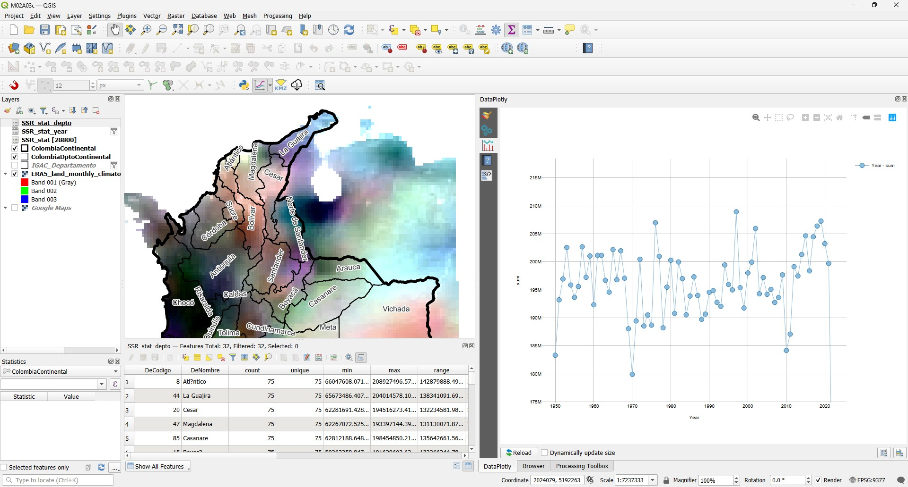

## Objetivos

Al finalizar esta actividad, el estudiante:

* Elabora mapas y planos.
* Descarga datos hidro-climatológicos de re-análisis a partir de datos satelitales ERA5.

## Requerimientos

Archivos, actividades previas, lecturas y herramientas requeridas para el desarrollo de esta actividad:

| Requerimiento                                                                                          | Descripción                                                                                                         |
|:-------------------------------------------------------------------------------------------------------|:--------------------------------------------------------------------------------------------------------------------|
| [:toolbox:Herramienta](https://qgis.org/)                                                              | QGIS 3.44 o superior.                                                                                               |  
| [:man_technologist:Cuenta de usuario _ECMWF Copernicus_](https://cds.climate.copernicus.eu/user/login) | Cuenta de usuario requerida para descarga de datos satelitales hidro-climatológicos mundiales ERA5.                 |  
| [:round_pushpin:IGAC_Departamento.shp](../../file/data/IGAC/IGAC_Departamento_20251023.zip)            | Municipios de Colombia obtenidos de https://www.colombiaenmapas.gov.co/.                                            |
| [:round_pushpin:ERA5 Land Colombia.nc](../../file/data/ERA5/)                                          | Datos satelitales hidro-climatológicos mundiales ERA5 de [Copernicus](https://www.copernicus.eu/en)                 |
| [qgis_netcdfstat.py](../../file/src/qgis_netcdfstat.py)                                                | Script Python para análisis estadístico de radiación solar, creado por [r.cfdtools](https://github.com/rcfdtools).  |

## 1. Obtención de límites geográficos

1. Desde el portal https://www.colombiaenmapas.gov.co, descargue la capa de Departamentos de Colombia, guarde como [/file/data/IGAC/IGAC_Departamento.zip](../../file/data/IGAC/IGAC_Departamento_20251023.zip) y descomprima en la carpeta _/shp_.

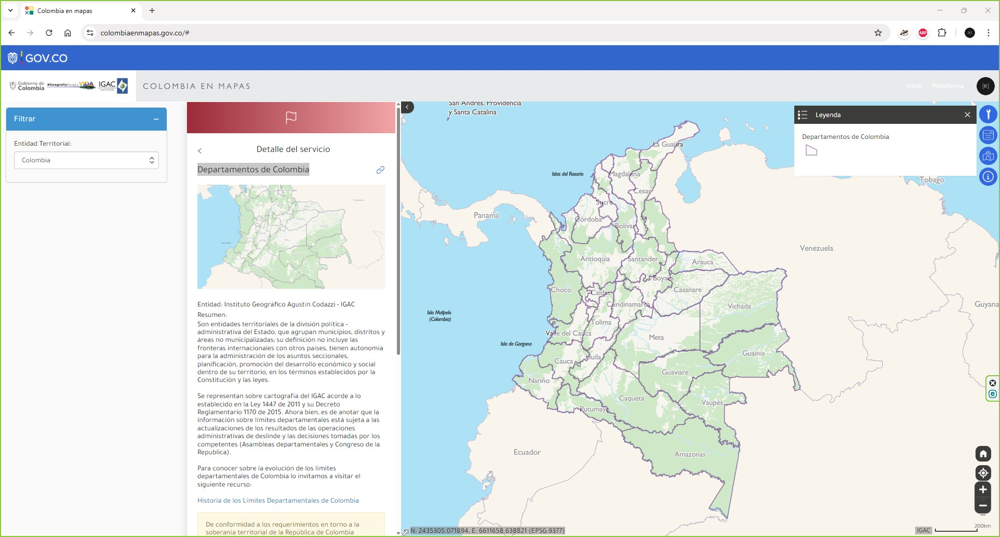

2. En un proyecto nuevo de QGIS, cargue la capa de _/shp/IGAC_Departamento.shp_ y excluya San Andrés con la expresión: `"DeNombre" <  > 'San Andrés Providencia y Santa Catalina'`, elimine los campos geométricos `Shape_Area` y `Shape_Leng`. Rotúle con el nombre del Departamento, guarde el mapa como _/map/ERA5.qgz_ y verifique que el CRS sea 9377.

> Para mejorar la visualización de los datos, agregue el mapa XYZ de Google Maps desde la url https://mt1.google.com/vt/lyrs=m&x={x}&y={y}&z={z}

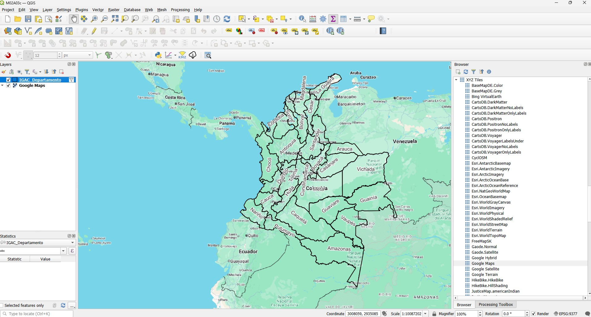

3. Exporte la capa filtrada de Departamentos como [/shp/ColombiaDptoContinental.shp](../../file/shp/ColombiaDptoContinental.zip). Con el calculador de campo, calcular el área geodésica en un campo numérico real de 10 de precisión con el nombre `AGm2`. 

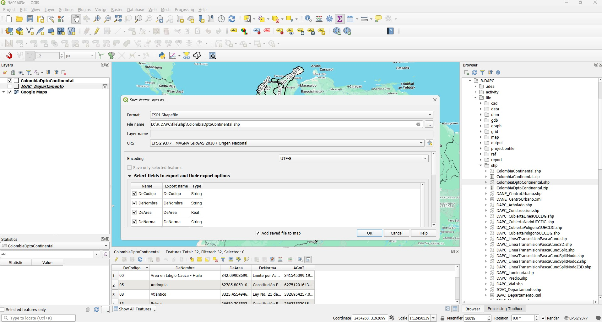

4. Disuelva la capa _/shp/ColombiaDptoContinental.shp_ para obtener el límite continental de Colombia, nombre como [/shp/ColombiaContinental.shp](../../file/shp/ColombiaContinental.zip).

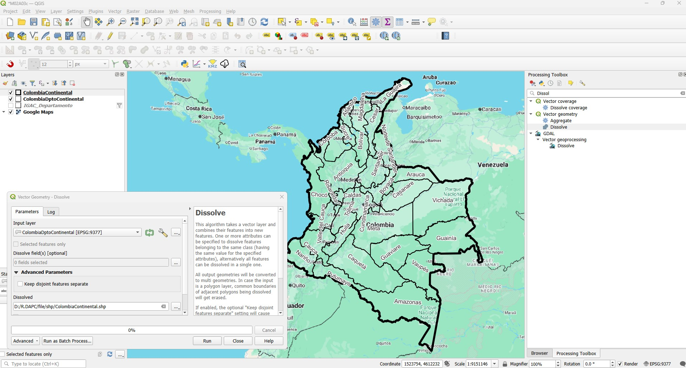

5. Para la capa _/shp/ColombiaContinental.shp_, cree campos numéricos reales con 10 de precisión y calcule los límites geográficos continentales de Colombia.

* North = `y_max(transform($geometry, layer_property(@layer, 'crs'),'EPSG:4326'))`
* South = `y_min(transform($geometry, layer_property(@layer, 'crs'),'EPSG:4326'))`
* East = `x_max(transform($geometry, layer_property(@layer, 'crs'),'EPSG:4326'))`
* West = `x_min(transform($geometry, layer_property(@layer, 'crs'),'EPSG:4326'))`

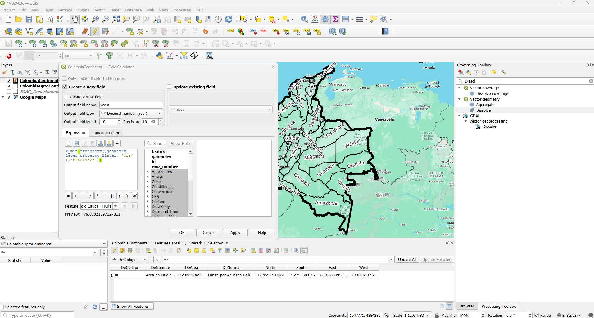

## 2. Descarga de datos climatológicos ERA5 Land (10km)

Descargar los datos de radiación y velocidad del viento en sus componentes norte y este desde https://cds.climate.copernicus.eu/ para el rango 1950 a 2024 (correspondientes a 900 meses).

Límites

* North: 12.5
* South: -4.3
* East: -66.8
* West: -79.1

Variables climatológicas

| Variable [^1]                                                                                     |       Unidades        | Descripción                                                                                                                                                                                                                                                                                                                                                                                                                                                                                                                                                                                                                                                                                                                                                                                                                                                                                                                                                                                                                                                                 |
|---------------------------------------------------------------------------------------------------|:---------------------:|-----------------------------------------------------------------------------------------------------------------------------------------------------------------------------------------------------------------------------------------------------------------------------------------------------------------------------------------------------------------------------------------------------------------------------------------------------------------------------------------------------------------------------------------------------------------------------------------------------------------------------------------------------------------------------------------------------------------------------------------------------------------------------------------------------------------------------------------------------------------------------------------------------------------------------------------------------------------------------------------------------------------------------------------------------------------------------|
| Surface net solar radiation (**ssr**) Radiación solar de onda corta                 |         J m-2         | Amount of solar radiation (also known as shortwave radiation) reaching the surface of the Earth (both direct and diffuse) minus the amount reflected by the Earth's surface (which is governed by the albedo).Radiation from the Sun (solar, or shortwave, radiation) is partly reflected back to space by clouds and particles in the atmosphere (aerosols) and some of it is absorbed. The rest is incident on the Earth's surface, where some of it is reflected. The difference between downward and reflected solar radiation is the surface net solar radiation. This variable is accumulated from the beginning of the forecast time to the end of the forecast step. The units are joules per square metre (J m-2). To convert to watts per square metre (W m-2), the accumulated values should be divided by the accumulation period expressed in seconds. The ECMWF convention for vertical fluxes is positive downwards.                                                                                                                                         |
| 10m u-component of wind (**u10**) Componente este del viento a 10 metros            |         m s-1         | Eastward component of the 10m wind. It is the horizontal speed of air moving towards the east, at a height of ten metres above the surface of the Earth, in metres per second. Care should be taken when comparing this variable with observations, because wind observations vary on small space and time scales and are affected by the local terrain, vegetation and buildings that are represented only on average in the ECMWF Integrated Forecasting System. This variable can be combined with the V component of 10m wind to give the speed and direction of the horizontal 10m wind.                                                                                                                                                                                                                                                                                                                                                                                                                                                                               |
| 10m v-component of wind (**v10**) Componente norte del viento a 10 metros           |         m s-1         | Northward component of the 10m wind. It is the horizontal speed of air moving towards the north, at a height of ten metres above the surface of the Earth, in metres per second. Care should be taken when comparing this variable with observations, because wind observations vary on small space and time scales and are affected by the local terrain, vegetation and buildings that are represented only on average in the ECMWF Integrated Forecasting System. This variable can be combined with the U component of 10m wind to give the speed and direction of the horizontal 10m wind.                                                                                                                                                                                                                                                                                                                                                                                                                                                                             |

1. En https://cds.climate.copernicus.eu/, seleccione la opción _Datasets_

2. En la ventana de búsqueda ingrese _ERA5-Land monthly averaged data from 1950 to present_

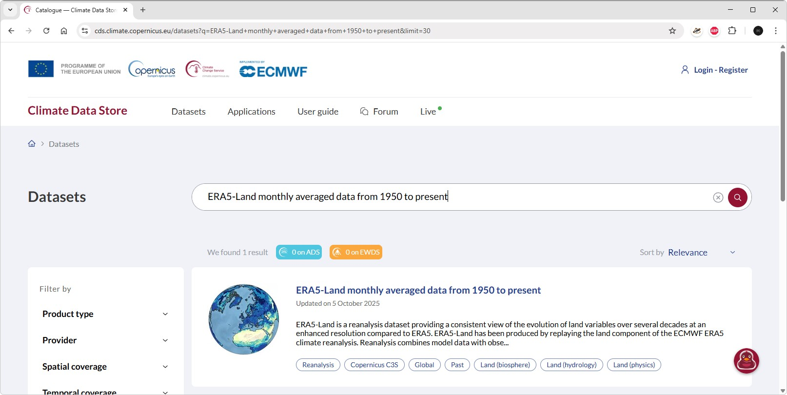

3. De clic en la pestaña _Download data_ y seleccione:

* Product type: Monthly average reanalysis.
* Variable: Surface net solar radiation, 10m u-component of wind, 10m v-component of wind.
* Year: 1950 to 2024.
* Month: January to December.
* Hour: 00:00.
* Sub-region extraction: North 12.5, South -4.3, West -79.1, East -66.8.
* Format: Zipped NetCDF-3 (experimental)

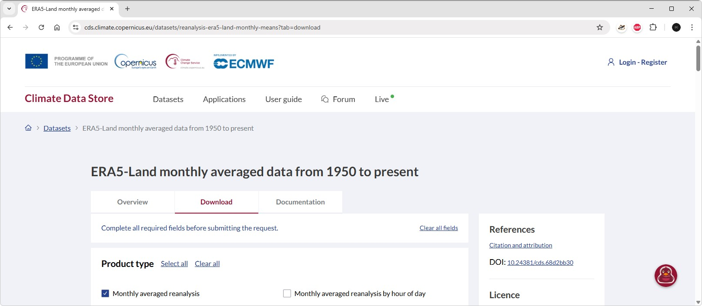

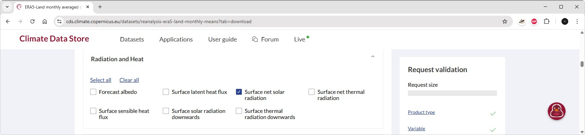

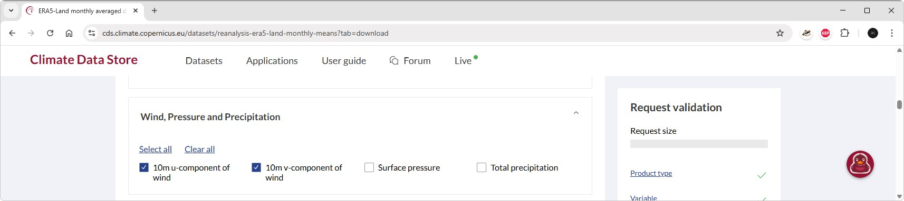

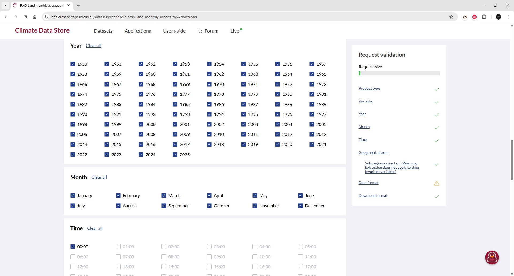

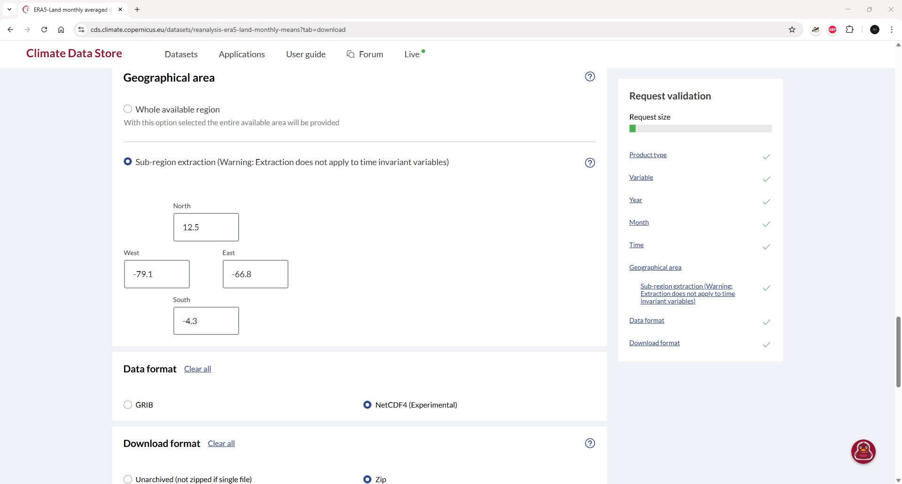

4. Para solicitar los datos, de clic en el botón _Login/Register to submit request_ o _Submit Form_ si previamente ya había ingresado con su cuenta de usuario de Copernicus.

Automáticamente, será redirigido a la ventana de solicitudes donde será necesario esperar hasta que sea completada la segmentación de descarga de datos solicitada. Una vez termine el proceso de extracción de datos aparecerá el botón de descarga. Descargue, guarde y renombre el dataset como [/data/ERA5/ERA5_land_monthly_climatological_var_010dd_ssr_uv10_Colombia.nc](../../file/data/ERA5/)

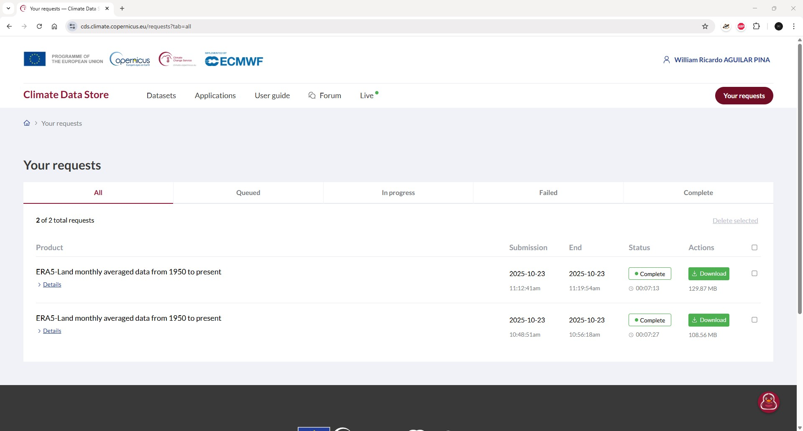

## 3. Visualización y procesamiento

1. Desde el archivo _/data/ERA5/ERA5_land_monthly_climatological_var_010dd_ssr_uv10_Colombia.nc_, cargue la variable _ssr_ correspondiente a Radiación solar de onda corta. En el panel _Layers_, de clic en el símbolo de interrogación y defina el CRS 4326. 

2. Exporte en formato GeoTiff y con el CRS 9377, el mapa _ssr_ y guarde cómo [/grid/ERA5_land_monthly_climatological_var_010dd_ssr_Colombia.tif](../../file/grid/ERA5_land_monthly_climatological_var_010dd_ssr_Colombia.zip). Una vez terminado, remueva de _Layers_ el mapa _ssr_ proveniente del archivo _.nc_.

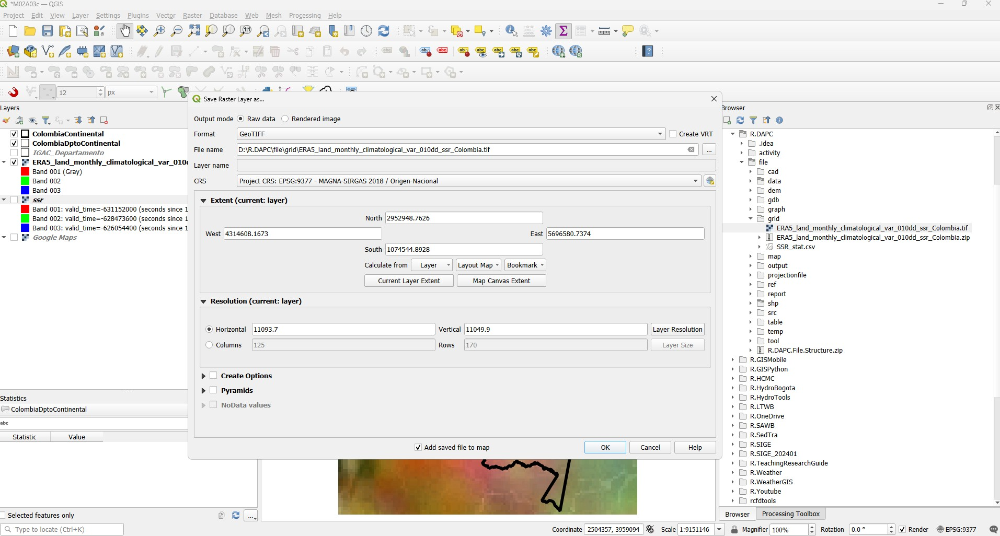

3. En la consola de Python, cargue el script [/src/qgis_netcdfstat.py](../../file/src/qgis_netcdfstat.py). Verifique y ajuste las rutas de ubicación de los archivos descargados.

> Para la correcta ejecución del script, es necesario crear la carpeta _/temp/stat_.

Rutas

* raster_path = 'D:/R.TSIG/file/grid/ERA5_land_monthly_climatological_var_010dd_ssr_Colombia.tif'
* polygon_path = 'D:/R.TSIG/file/shp/ColombiaDptoContinental.shp'
* output_path = 'D:/R.TSIG/file/temp/stat/'

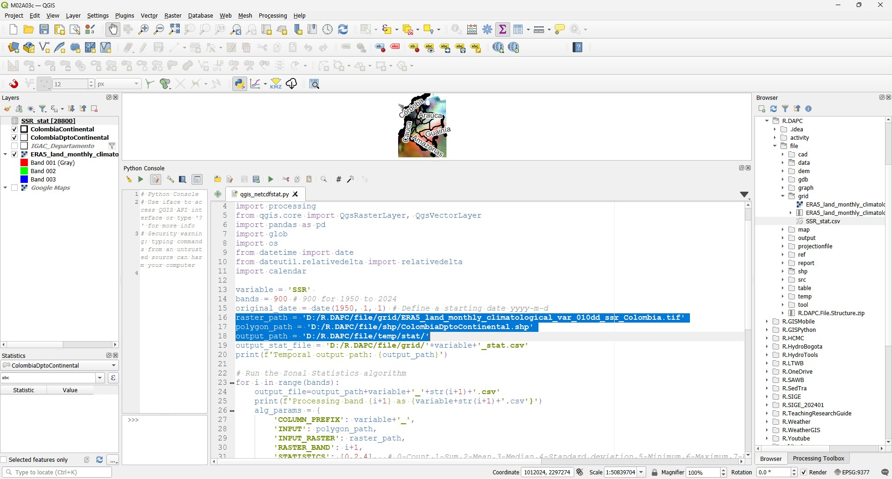

4. Ejecute el script y espere hasta que sean evaluadas las 900 bandas correspondientes a 75 años de datos. El análisis estadístico es realizado para cada uno de los Departamentos de Colombia. Luego de finalizada la ejecución, obtendrá el archivo [/table/SSR_stat.csv](../../file/table/SSR_stat.csv) con los estadísticos zonales de cada instante de tiempo.

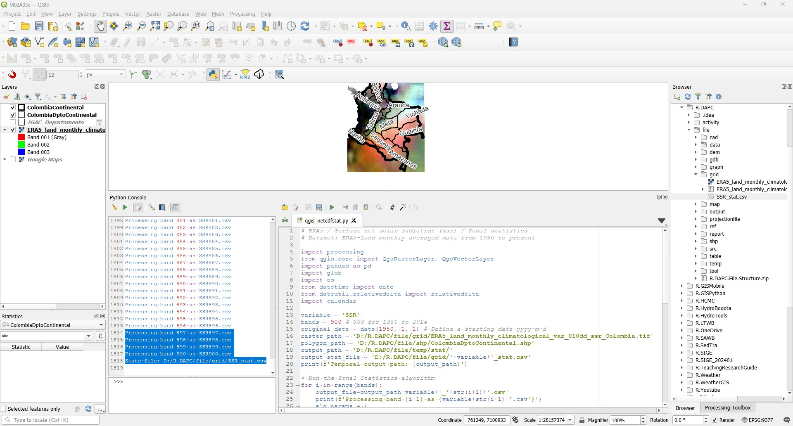

5. Desde el menú _Layer / Add Layer / Add Delimited Text Layer..._, cargue al proyecto el archivo de resultados estadísticos que contiene 28800 registros correspondientes a 900 bandas multiplicadas por 32 polígonos continentales de Departamentos.

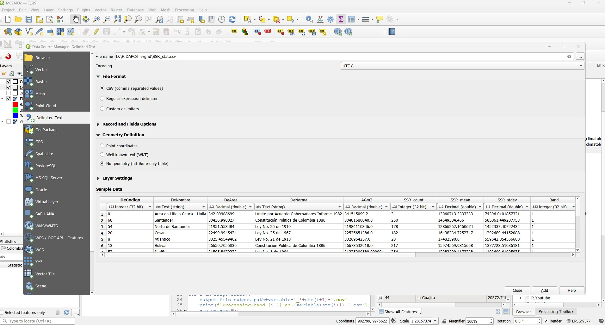

Podrá observar los siguientes campos de atributos:

| Campo      | Tipo    | Descripción                                                                                                                         |
|:-----------|:--------|:------------------------------------------------------------------------------------------------------------------------------------|
| DeCodigo   | Integer | Código de Departamento                                                                                                              |
| DeNombre   | Text    | Nombre de Departamento                                                                                                              |
| DeArea     | Double  | Area planar del Departamento en km²                                                                                                 |
| DeNorma    | Text    | Norma nacional de reconocimiento de límites geográficos del Departamento                                                            |
| AGm2       | Double  | Area geográfica del Departamento en m² calculada a partir del CRS 9377                                                              |
| SSR_count  | Integer | Conteo de pixeles evaluado en la estadística zonal por Departamento y por mes                                                       |
| SSR_mean   | Double  | Promedio zonal de valores de radiación solar en J/m² por Departamento y por mes                                                     |
| SSR_stdev  | Double  | Desviación estándar zonal de valores de radiación solar en J/m² por Departamento y por mes                                          |
| Band       | Integer | Número de banda, p . ej., 1 corresponde a 1950/01/01                                                                                |
| Date       | Date    | Fecha correspondiente al número de banda                                                                                            |
| Decade     | Integer | Década correspondiente a la fecha de la banda                                                                                       |
| Year       | Integer | Año correspondiente a la fecha de la banda                                                                                          |
| Month      | Integer | Mes correspondiente a la fecha de la banda                                                                                          |
| MonthDays  | Integer | Días en el mes correspondientes a cada banda                                                                                        |
| MonthSecs  | Integer | Segundos en el mes correspondientes a cada banda                                                                                    |
| SSR_Wattm2 | Double  | Potencia de energía solar o irradiancia por Departamento en Watt/m² y para cada mes. Se obtiene de: `SSR_mean / MonthSecs`          |
| SSR_GWatt  | Double  | Potencia solar total sobre toda la superficie del Departamento en Giga Watt para cada mes. Se obtiene de: `SSR_Wattm2 * AGm2 / 1e9` |

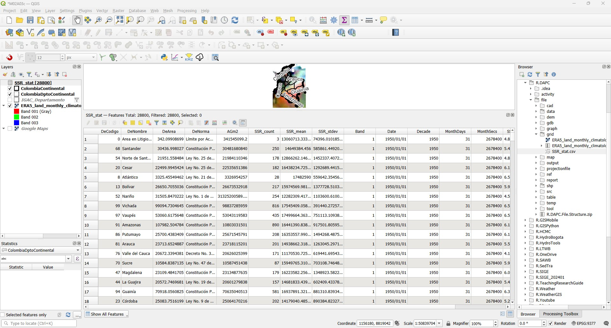

## 4. Análisis de resultados

1. Utilizando la herramienta _Vector analysis / Statistics by categories_, obtenga sumatoria de la radiación solar de cada año. En los campos categóricos incluya `DeCodigo`, `DeNombre`, `Decade`, `Year` y utilice `SSR_mean` como el campo numérico para el cálculo estadístico. Guarde el archivo de resultados como [/table/SSR_stat_year.csv](../../file/table/SSR_stat_year.csv). 

> Obtendrá 2400 registros correspondientes a dividir 28800 entre 12 meses. El campo `sum` contendrá la sumatoria de los valores mensuales de cada año y cada Departamento. Automáticamente, será cargado el archivo de resultados al proyecto, remuévalo para luego cargarlo como un archivo de texto delimitado.

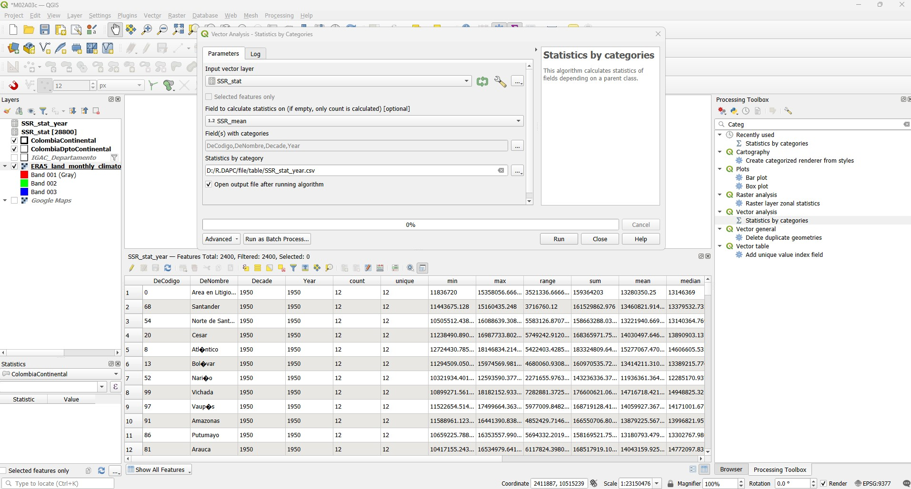

2. Desde el menú _Layer / Add Layer / Add Delimited Text Layer..._, cargue al proyecto el archivo de resultados estadísticos _/table/SSR_stat_year.csv_.

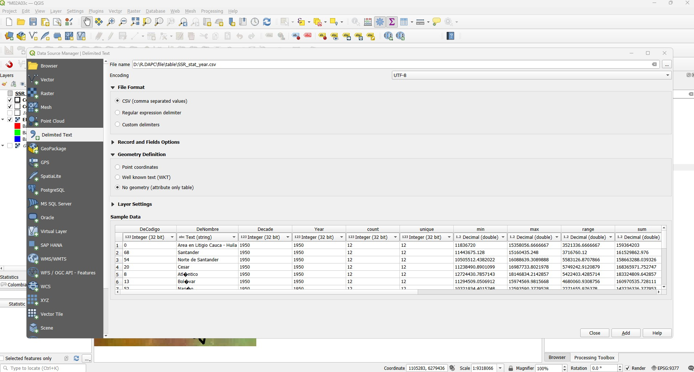

3. A partir del archivo _/table/SSR_stat_year.csv_ adicionado y con la misma herramienta _Statistics by categories_, obtenga el promedio total multianual de la radiación solar por Departamento. Guarde el archivo de resultados como [/table/SSR_stat_depto.csv](../../file/table/SSR_stat_depto.csv).

> Obtendrá 32 registros correspondientes a dividir 2400 entre 75 años. El campo `mean` contendrá el promedio de los valores totales anuales de cada Departamento. Al ordenar ascendentemente los valores de la columna mean, podrá observar que el Departamento con menor promedio radiación sola es Chocó con 127150449.8 J/m² y el de mayor promedio es Atlántico con 193637963.5 J/m² seguido de La Guajira con 191980068.9 J/m².

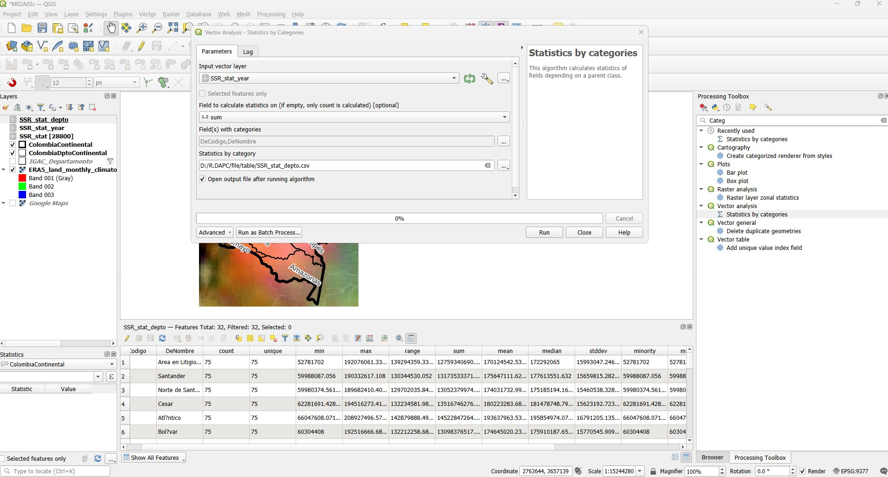

4. Utilizando el complemento _Data Plotly_, cree un gráfico de barras que represente los valores medios anuales obtenidos por Departamento.

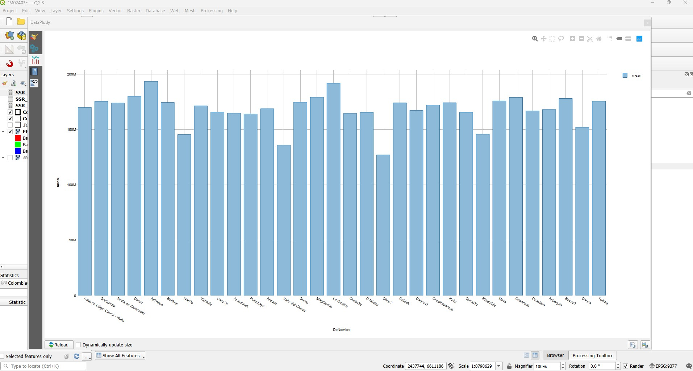

5. En la tabla _/table/SSR_stat_year.csv_, filtre los registros 75 registros anuales correspondientes al Departamento del Atlántico y grafique por dispersión la serie de valores anuales contenida en el campo `sum` cada año. 

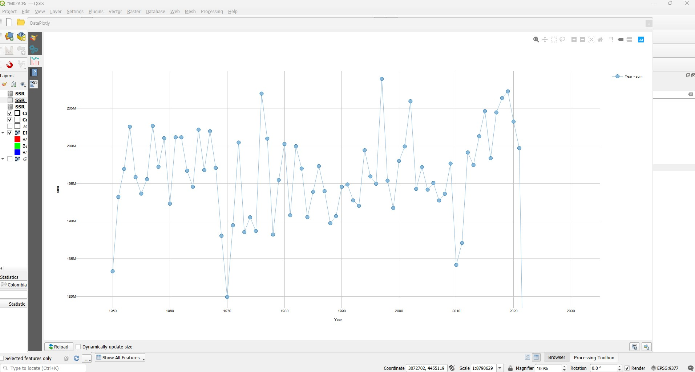

## Referencias

* https://data.europa.eu/data/datasets/d08cd288-a2c5-4c8d-a621-eedc33fab449?locale=es
* https://www.ecmwf.int/en/forecasts/dataset/ecmwf-reanalysis-v5
* [ERA5: How to calculate wind speed and wind direction from u and v components of the wind?](https://confluence.ecmwf.int/pages/viewpage.action?pageId=133262398)

## Control de versiones

| Versión    | Descripción        | Autor                                       | Horas |
|------------|:-------------------|---------------------------------------------|:-----:|
| 2025.10.24 | Versión inicial.   | [rcfdtools](https://github.com/rcfdtools)   |   8   |

##

_R.TSIG es de uso libre para fines académicos, conoce nuestra licencia, cláusulas, condiciones de uso y como referenciar los contenidos publicados en este repositorio, dando [clic aquí](../../LICENSE.md)._

_¡Encontraste útil este repositorio!, apoya su difusión marcando este repositorio con una ⭐ o síguenos dando clic en el botón Follow de [rcfdtools](https://github.com/rcfdtools) en GitHub._

| [:house: Inicio](../../README.md) | [:beginner: Ayuda / Colabora](https://github.com/rcfdtools/R.TSIG/discussions/1) |
|-----------------------------------|----------------------------------------------------------------------------------|

[^1]: https://cds.climate.copernicus.eu/cdsapp#!/dataset/reanalysis-era5-land-monthly-means?tab=overview