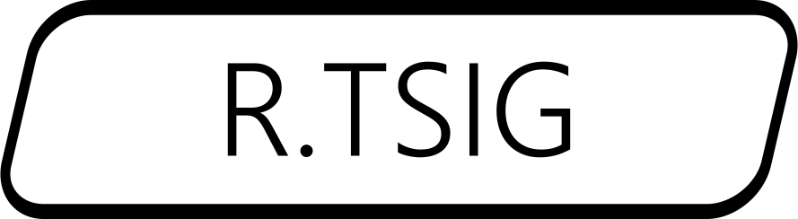

<div align="center"></div>

# [:large_blue_circle:]()Taller 0. Introducción y conceptos básicos de GIS en ingeniería

Este taller presenta los conceptos generales de los sistemas de información geográfica, aplicación, utilidad, georreferenciación, funciones de un SIG, tipos de datos y codificación, formatos para almacenamiento geográfico, tipos de herramientas SIG, versiones y herramientas que componen los paquetes ArcGIS y QGIS. Este taller es una introducción general a los SIG como herramienta de toma de decisiones en ingeniería y presenta contenidos relacionados con conceptos de sistemas de proyección y georreferenciación.

La gran diferencia que existe entre un aplicativo SIG y otros paquetes de software gráfico radica en que el aplicativo SIG es esencialmente una base de datos espacial, lo que otorga una cualidad incomparable en el desarrollo de análisis enfocados a resolver problemas reales que afectan el espacio geográfico estudiado.

# 1.0 Introducción, conceptos básicos y georreferenciación
Keywords: `topography` `photogrammetric` `earth-shape` `gnss` `gis-basics` `gis-utility` `gis-functions` `gis-history` `data-types` `related-sciences` `shapefile` `gdb` `crs` `srs` `epsg-4326` `wgs84`

Sistemas de información geográfica. Fundamentos. Proyecciones y origen de coordenadas. 

<div align="center"><sub><br>Tomado de: <a href="Public Domain, https://commons.wikimedia.org/w/index.php?curid=479365">https://commons.wikimedia.org</a></sub><br><br></div>


## Objetivos

Al finalizar esta actividad, el estudiante:

* Comprende los conceptos y fundamentos básicos de los sistemas de información geográfica.
* Entiende conceptos básicos de topografía y sus ramas derivadas.
* Entiende su aplicación y utilidad.
* Entiende las diferencias entre planimetría y altimetría.
* Entiende cómo los SIG se utilizan como herramienta para la toma de decisiones a partir de datos espaciales.
* Estudia las diferentes aplicaciones de los SIG en entornos corporativos y gubernamentales.
* Entiende sus ventajas y desafíos.
* Aprende acerca de los tipos de datos y formatos comúnmente utilizados por los SIG.
* Entiende conceptos generales de georreferenciación.
* Estudia los sistemas de proyección utilizados en Colombia.
* Entiende como funciona el sistema geográfico mundial WGS84.


## Requerimientos

Archivos, actividades previas, lecturas y herramientas requeridas para el desarrollo de esta actividad:

<div align="center">

| Requerimiento                                                                                       | Descripción                                        |
|:----------------------------------------------------------------------------------------------------|:---------------------------------------------------|
| [:notebook:Lectura](https://www.esri.com/es-es/geographic-approach/overview)                        | Resolución de problemas con un enfoque geográfico. |  
| [:notebook:Lectura](https://www.esri.com/es-es/geographic-approach/case-studies/government)         | Geografía y Gobierno.                              |        
| [:notebook:Lectura](https://www.esri.com/es-es/what-is-gis/overview)                                | ¿Qué son los SIG?                                  |        
| [:notebook:Lectura](https://resources.arcgis.com/es/help/main/10.1/index.html#//003r00000001000000) | ¿Qué son las proyecciones cartográficas?           |           
| [:notebook:Lectura](https://es.wikipedia.org/wiki/Forma_de_la_Tierra)                               | Forma de la tierra.                                |
| [:date:TSIG_Georreferenciacion.xlsx](../../file/table/TSIG_Georreferenciacion.xlsx)                 | Cálculos básicos de la forma de la tierra.         |

</div>


## A. Conceptos básicos de topografía, fotogrametría y fotointerpretación

La topografía se trata de la medición de las características físicas o geométricas de la Tierra. Los levantamientos topográficos se clasifican a menudo por el tipo de datos estudiados o por los instrumentos o métodos utilizados. Algunos ejemplos son los estudios geodésicos, geológicos, topográficos, hidrográficos, terrestres, geofísicos, de suelos, de minas y de ingeniería.[^1]


### 1. ¿Qué es la Topografía? [^2]

La topografía es una ciencia que estudia el conjunto de procedimientos para determinar las posiciones relativas de los puntos sobre la superficie de la tierra y debajo de la misma, mediante la combinación de las medidas según los tres elementos del espacio: 

| Elemento                                                                                   | Descripción                                                                                                                                                                                                                                                                                                                                                                                                                                                                                                                                                                         |
|:-------------------------------------------------------------------------------------------|:------------------------------------------------------------------------------------------------------------------------------------------------------------------------------------------------------------------------------------------------------------------------------------------------------------------------------------------------------------------------------------------------------------------------------------------------------------------------------------------------------------------------------------------------------------------------------------|
| [Distancia](https://es.wikipedia.org/wiki/Distancia)                                       | En las matemáticas, la distancia entre dos puntos del espacio euclídeo equivale a la longitud del segmento de la recta que los une, expresado numéricamente. En espacios más complejos, como los definidos en la geometría no euclidiana, el _camino más corto_ entre dos puntos es un segmento recto con curvatura llamada geodésica.                                                                                                                                                                                                                                              |
| [Elevación](https://es.wikipedia.org/wiki/Elevaci%C3%B3n_(ubicaci%C3%B3n_geogr%C3%A1fica)) | La elevación de una ubicación geográfica es la altura por encima o por debajo de un punto de referencia fijo, más comúnmente una referencia geoide, un modelo matemático del nivel del mar de la Tierra como una superficie equipotencial. El término elevación se usa principalmente cuando se hace referencia a puntos en la superficie de la Tierra, mientras que la altitud o la altura geopotencial se usa para puntos sobre la superficie, como la de un avión en vuelo o la de una nave espacial en órbita, y la profundidad se utiliza para puntos debajo de la superficie. |
| [Dirección](https://es.wikipedia.org/wiki/Direcci%C3%B3n_(geometr%C3%ADa))                 | Una dirección es la información contenida en la posición relativa de un punto respecto a otro punto sin información sobre la distancia. Las direcciones pueden ser o bien relativas respecto a una referencia determinada, o bien absolutas de acuerdo con algún marco de referencia previamente acordado.                                                                                                                                                                                                                                                                          |


> La topografía explica los procedimientos y operaciones del trabajo de campo, los métodos de cálculo o procesamiento de datos y la representación del terreno en un plano o dibujo topográfico a escala. La combinación de estos elementos se denomina Levantamiento topográfico.

Las 3 ramas principales de la topografía son la geodesía, la fotogrametría y la topografía plana. Tenga en cuenta que la definición de estas ramas puede variar de un autor a otro y que estas han sido utilizadas para ilustrar esta actividad.


### 2. Geodesia[^2]

Trata de las mediciones de grandes extensiones de terreno, por ejemplo, para crear la carta geográfica de un país, para establecer fronteras y límites internos, para la determinación de líneas de navegación en ríos y lagos, etc. Estos levantamientos tienen en cuenta la verdadera forma de la tierra y requieren de gran precisión. 

<div align="center"><sub><br>Tomado de: <a href="https://commons.wikimedia.org/wiki/File:Geoid_undulation_10k_scale.jpg">https://commons.wikimedia.org</a></sub><br><br></div>

Cuando la zona no es demasiado extensa, se puede obtener la precisión requerida considerando la tierra como una esfera perfecta, pero si dicha superficie es muy grande debe adoptarse la verdadera forma elipsoidal de la superficie terrestre.

<div align="center"><sub><br>Tomado de: <a href="https://commons.wikimedia.org/wiki/File:WGS84_mean_Earth_radius.svg">https://commons.wikimedia.org</a></sub><br><br></div>


#### 2.1 Red geodésica de control

Los levantamientos de grandes ciudades se hacen bajo el supuesto de que la tierra es perfectamente esférica. Este tipo de levantamiento está catalogado como de alta precisión e incluye el establecimiento de los puntos de control primario o puntos geodésicos, que son puntos debidamente materializados sobre la superficie de la tierra, es decir, con posiciones y elevaciones conocidas, las cuales son de gran importancia y trascendencia por constituir puntos o redes de apoyo y referencia confiables para todos los demás levantamientos de menor precisión. Los puntos fijados geodésicamente (levantamiento de control), como por ejemplo los vértices de triangulación, constituyen una red a la que puede referirse cualquier otro levantamiento sin temor a error alguno en distancias horizontal o vertical o en dirección, derivado de la diferencia entre la superficie de referencia y la verdadera superficie de la tierra. 

<div align="center"><sub><br>Tomado de: <a href="https://commons.wikimedia.org/wiki/File:%C3%9Cbersicht_der_Stationen.PNG">https://commons.wikimedia.org</a></sub><br><br></div>


#### 2.2. Sistema global de navegación por satélite - GNSS[^3]

Los sistemas de navegación por satélite transmiten información de geolocalización altamente precisa a los dispositivos y receptores [GNSS](https://es.wikipedia.org/wiki/Sistema_global_de_navegaci%C3%B3n_por_sat%C3%A9lite) para determinar su ubicación actual, tales como [GPS](https://es.wikipedia.org/wiki/GPS), [GLONASS](https://es.wikipedia.org/wiki/GLONASS), [Galileo](https://es.wikipedia.org/wiki/Galileo_(navegaci%C3%B3n_por_sat%C3%A9lite)), [QZSS](https://es.wikipedia.org/wiki/Quasi-Zenith), [BeiDou](https://es.wikipedia.org/wiki/Beidou) y [NavIC](https://en.wikipedia.org/wiki/Indian_Regional_Navigation_Satellite_System).

<div align="center"><sub><br>Tomado de: <a href="https://commons.wikimedia.org/wiki/File:%D0%97%D0%B9%D0%BE%D0%BC%D0%BA%D0%B0_%D0%B2%D0%B0%D0%BB%D1%96%D0%B2_%D0%91%D1%96%D0%BB%D1%8C%D1%81%D1%8C%D0%BA%D0%BE%D0%B3%D0%BE_%D0%B3%D0%BE%D1%80%D0%BE%D0%B4%D0%B8%D1%89%D0%B0_(%D0%9F%D0%BE%D0%BE%D0%BB%D1%82%D0%B0%D0%B2%D1%89%D0%B8%D0%BD%D0%B0)_%D0%B2%D0%B8%D1%81%D0%BE%D0%BA%D0%BE%D1%82%D0%BE%D1%87%D0%BD%D0%B8%D0%BC_GNSS-%D0%BF%D1%80%D0%B8%D0%B9%D0%BC%D0%B0%D1%87%D0%B5%D0%BC.jpg">https://commons.wikimedia.org</a></sub><br><br></div>

GNSS significa Sistema global de navegación por satélite y se utiliza para describir cualquier sistema de navegación por satélite con cobertura global. Los sistemas de navegación por satélite transmiten información de geolocalización altamente precisa a los dispositivos y receptores GNSS para determinar su ubicación actual.

> En la mayoría de partes del mundo, es habitual hacer referencia a la navegación global como GPS (Sistema de posicionamiento global). En la práctica, el GPS es un sistema especial basado en Norteamérica. Hay un número creciente de sistemas de navegación por satélite disponibles para el público internacional. Se recomienda utilizar el término GNSS para describir todos los sistemas, ya que es el término más representativo internacionalmente.

<div align="center"><sub><br>Tomado de: <a href="www.swisstopo.admin.ch">www.swisstopo.admin.ch</a></sub><br><br></div>

<div align="center"><sub><br>Ejemplo de una estación de referencia GNSS<br>Tomado de: <a href="https://commons.wikimedia.org/wiki/File:DGPS_Reference_Station.jpg">https://commons.wikimedia.org</a></sub><br><br></div>


### 3. Fotogrametría y Fotointerpretación [^2]

Es la disciplina que utiliza las fotografías para la obtención de mapas de terrenos. 

<div align="center"><sub><br>Tomado de: <a href="https://commons.wikimedia.org/wiki/File:PIA21210_-_Satellite_Radar_Show_Complex_Set_of_Faults_Moved_in_2016_New_Zealand_Earthquake.jpg">https://commons.wikimedia.org</a></sub><br><br></div>

Los levantamientos fotogramétricos comprenden la obtención de datos y mediciones precisas a partir de fotografías del terreno tomadas con cámaras especiales u otros instrumentos sensores, ya sea desde aviones o drones (fotogrametría aérea) o desde puntos elevados del terreno (fotogrametría terrestre) y que tiene aplicación en trabajos topográficos. Se utilizan los principios de la perspectiva para la proyección sobre planos a escala, de los detalles que figuran en las fotografías. Los trabajos fotogramétricos deben apoyarse sobre puntos visibles y localizados por métodos de triangulación topográfica o geodésicos que sirven de control tanto planimétrico como altimétrico.

<div align="center"><sub><br>Tomado de: <a href="https://visualdrone.co/">https://visualdrone.co/</a></sub><br><br></div>

> El trabajo consiste en esencia en tomar fotografías desde dos o más estaciones adecuadas y utilizarlas después para obtener los detalles del terreno fotografiado, tanto en planta como en alzado o perfil.

Como una derivación de la fotogrametría, está la fotointerpretación que se emplea para el análisis cualitativo de los terrenos. La fotogrametría aérea se basa en fotografías tomadas desde aviones o drones equipados para el trabajo, en combinación de las técnicas de aerotriangulación analítica para establecer posiciones de control para la obtención de proyecciones reales del terreno y para hacer comprobaciones con una menor precisión que la obtenida en las redes primarias de control geodésico. 

> Tienen las ventajas de la rapidez con que se hace el trabajo, la profusión de los detalles y su empleo en lugares de difícil o imposible acceso desde el propio terreno.

<div align="center"><sub><br>NVDI index<br>Tomado de: <a href="https://eightfourcapital.medium.com/why-we-use-ndvi-a0d5172e6e6">https://eightfourcapital.medium.com</a></sub><br><br></div>


### 4. Topografía plana

El levantamiento topográfico plano tiene la misma finalidad de los levantamientos geodésicos, pero difiere en cuanto a la magnitud y precisión y por consiguiente en los métodos empleados.

<div align="center"><sub><br>Ejemplo de un mapa topográfico<br>Tomado de: <a href="https://commons.wikimedia.org/wiki/File:Topographic_map_example.png">https://commons.wikimedia.org</a></sub><br><br></div>

Esta área se encarga de la medición de terrenos y lotes o parcelas de áreas pequeñas, proyectados sobre un plano horizontal, despreciando los efectos de la curvatura terrestre. La mayor parte de los levantamientos en proyectos de ingeniería son de esta clase, ya que los errores cometidos al no tener en cuenta la curvatura terrestre son despreciables y el grado de precisión obtenido queda dentro de los márgenes permisibles desde el punto de vista práctico.

<div align="center"><sub><br>Levantamiento topográfico<br>Tomado de: <a href="https://commons.wikimedia.org/wiki/File:Geodeziistoj_de_kompanio_%22Gazprom_projektirovanije%22_plenumas_konkursajn_taskojn_de_elekta_etapo_de_la_3-a_konstrua_%C4%89ampionado_de_Rusio_07.jpg">https://commons.wikimedia.org</a></sub><br><br></div>

La mayor parte de los levantamientos de la topografía tienen por finalidad el cálculo de la superficie o áreas, volúmenes, distancias, direcciones y la representación de las medidas tomadas en el campo mediante los planos topográficos correspondientes.

<div align="center"><sub><br>Plano topográfico<br>Tomado de: <a href="https://lhongtortai.com/collection/que-es-un-plano-topografico">https://lhongtortai.com</a></sub><br><br></div>

Estos planos se utilizan como base para la mayoría de los trabajos y proyectos de ingeniería relacionados con la planeación y construcción de obras civiles. Por ejemplo, se requieren levantamientos topográficos antes, durante y después de la planeación y construcción de:

* Carreteras
* Vías férreas
* Sistemas de transporte masivo
* Edificios
* Puentes
* Túneles
* Canales
* Obras de irrigación
* Presas
* Sistemas de drenaje
* Subdivisión de terrenos urbanos y rurales
* Sistemas de aprovisionamiento de agua potable (acueductos)
* Redes de aguas servidas (alcantarillados)
* Oleoductos y gasoductos
* Líneas de transmisión eléctrica
* Control de la aerofotografía
* Determinación de límites de terrenos de propiedad privada y pública (linderos y medianeras)
* Actividades relacionadas con geología, arquitectura del paisaje, arqueología, etc.


### 5. Estudio de la topografía[^2]

#### 5.1. Planimetría o control horizontal

Solo tiene en cuenta la proyección del terreno sobre un plano horizontal imaginario (vista en planta) que se supone que es la superficie media de la tierra; esta proyección se denomina base productiva y es la que se considera cuando se miden distancias horizontales y se calcula el área de un terreno. Aquí no interesan las diferencias relativas de las elevaciones entre los diferentes puntos del terreno. La ubicación de los diferentes puntos sobre la superficie de la tierra se hace mediante la medición de ángulos y distancias a partir de puntos y líneas de referencia proyectadas sobre un plano horizontal.


##### 5.1.1. Poligonal abierta o cerrada

<div align="center"><sub><br>Poligonal abierta<br>Tomado de: <a href="https://bdigital.uniquindio.edu.co/bitstream/handle/001/5932/Capitulo%206%20poligonales.pdf">https://bdigital.uniquindio.edu.co/</a></sub><br><br></div>

El conjunto de líneas que unen los puntos observados se denomina Poligonal Base y es la que conforma la red fundamental o esqueleto del levantamiento, a partir de la cual se referencia la posición de todos los detalles o accidentes naturales y/o artificiales de interés. La poligonal base puede ser abierta o cerrada según los requerimientos del levantamiento topográfico. Como resultado de los trabajos de planimetría se obtiene un esquema horizontal.

<div align="center"><sub><br>Poligonal cerrada<br>Tomado de: <a href="https://bdigital.uniquindio.edu.co/bitstream/handle/001/5932/Capitulo%206%20poligonales.pdf">https://bdigital.uniquindio.edu.co/</a></sub><br><br></div>


##### 5.1.2. Redes poligonales y ramificadas

En algunos trabajos de gran extensión es recomendable establecer una red de polígonos dentro de una poligonal cerrada, para así tener una forma de acceder a lugares en los cuales se requiere tomar información que no puede ser vista desde las estaciones perimetrales de la poligonal.

<div align="center"><sub><br>Poligonal ramificada<br>Tomado de: <a href="https://bdigital.uniquindio.edu.co/bitstream/handle/001/5932/Capitulo%206%20poligonales.pdf">https://bdigital.uniquindio.edu.co</a></sub><br><br></div>


#### 5.2. Altimetría o control vertical

La altimetría se encarga de la medición de las diferencias de nivel o de elevación entre los diferentes puntos del terreno, las cuales representan las distancias verticales medidas a partir de un plano horizontal de referencia. La determinación de las alturas o distancias verticales también se puede hacer a partir de las mediciones de las pendientes o grado de inclinación del terreno y de la distancia inclinada entre cada dos puntos. Como resultado se obtiene el esquema vertical.

<div align="center"><sub><br>Perfil vial<br>Tomado de: <a href="https://commons.wikimedia.org/wiki/File:Perfil_L-401.jpg">https://commons.wikimedia.org</a></sub><br><br></div>


#### 5.3. Planimetría y altimetría simultáneas

La combinación de las dos áreas de la topografía plana permite la elaboración o confección de un "plano topográfico", donde se muestra tanto la posición en planta como la elevación de cada uno de los diferentes puntos del terreno. La elevación o altitud de los diferentes puntos del terreno se representa mediante las curvas de nivel, que son líneas trazadas en el plano de planta con base en el esquema horizontal y que unen puntos que tienen igual altura. Las curvas de nivel sirven para reproducir en el dibujo la configuración topográfica o relieve del terreno.

<div align="center"><sub><br>Impresión 3D<br>Tomado de: <a href="https://opentopography.org/learn/3D_printing">https://opentopography.org</a></sub><br><br></div>


## B.  Conceptos básicos de SIG 

Los Sistemas de Información Geográficos (SIG o GIS), son un conjunto de equipos, herramientas computacionales y personal capacitado para el manejo de datos geográficos. Hoy en día se han convertido en herramientas indispensables para el análisis y soporte de toma de decisiones en la solución de problemas complejos, debido a que el manejo de la información se realiza de forma espacial y dinámica, permitiendo representar de forma esquemática muy próxima a la realidad el ambiente natural y el entorno construido. Igualmente, los SIG permiten interactuar eficientemente con otro tipo de información no geográfica y su incorporación para diferentes aplicaciones.

<div align="center"><sub><br>Tomado de: <a href="https://ecijg.maps.arcgis.com/apps/mapviewer/index.html?layers=ce76f13d1e9d46c5a229d00c37bbb8a3">https://ecijg.maps.arcgis.com</a></sub><br><br></div>

> La gran diferencia que existe entre un aplicativo SIG y otros paquetes de software gráfico radica en que el aplicativo SIG es esencialmente una base de datos espacial, lo que otorga una cualidad incomparable en el desarrollo de análisis enfocados a resolver problemas reales que afectan el espacio geográfico estudiado.   


### 1. Historia de los SIG como ciencia[^4]

En las últimas décadas, los **_SIG han pasado de ser un concepto a convertirse en una ciencia_**. La espectacular evolución de los SIG de una herramienta rudimentaria a una plataforma moderna y potente para comprender y planear nuestro mundo está marcada por varios hitos clave.

El campo de los sistemas de información geográfica (GIS) se inició en los años sesenta, cuando surgieron los ordenadores y los primeros conceptos de geografía cuantitativa y computacional. Los primeros trabajos de SIG incluían investigaciones importantes de la comunidad académica. Más tarde, el National Center for Geographic Information and Analysis de los Estados Unidos de América, dirigido por Michael Goodchild, formalizó la investigación sobre temas clave relacionados con la ciencia de información geográfica, como el análisis y la visualización espaciales. Este trabajo impulsó una revolución cuantitativa en el mundo de la ciencia geográfica y sentó las bases para los SIG. 

Línea de tiempo

|  Año  | Evento                                                                                                                                                              |
|:-----:|:--------------------------------------------------------------------------------------------------------------------------------------------------------------------|
| 1960  | Inicio de los SIG en investigación científica                                                                                                                       |
| 1963  | Primer SIG implementando el Sistema Canadiense de Información Geográfica utilizado para inventario forestal                                                         |
| 1965  | Laboratorio SIG Universidad de Harvard y creación del software [SYMAP](https://en.wikipedia.org/wiki/Harvard_Laboratory_for_Computer_Graphics_and_Spatial_Analysis) |
| 1969  | Fundación de Environmental Systems Research Institute, Inc. - [Esri](https://www.esri.com/en-us/what-is-gis/history-of-gis)                                         |
| 1982  | SIG se Vuelve comercial y Esri crea [ARC/INFO](https://en.wikipedia.org/wiki/ArcInfo)                                                                               |
|  Hoy  | Utilizados en la vida diaria y como herramienta tecnológica se utilizan en múltiples campos de la ingeniería y arquitectura.                                        |


### 2. Ciencias y tecnologías relacionadas[^5]


#### 2.1. Estudio de la tierra sólida

<div align="center"><sub><br>Tomado de: <a href="https://commons.wikimedia.org/wiki/File:Gunung_Bromo.jpg">https://commons.wikimedia.org</a></sub><br><br></div>

| Ciencia                                                                 | Alcance                                                                                                                                                                                                                                                                                      |
|:------------------------------------------------------------------------|:---------------------------------------------------------------------------------------------------------------------------------------------------------------------------------------------------------------------------------------------------------------------------------------------|
| [Geodesía](https://es.wikipedia.org/wiki/Geodesia)                      | Estudia la forma de la Tierra.                                                                                                                                                                                                                                                               |
| [Geofísica](https://es.wikipedia.org/wiki/Geof%C3%ADsica)               | Estudio del planeta desde el punto de vista de la física. Se analizan y modelan los fenómenos geológicos, con el fin de lograr una descripción matemática y geométrica de los mismos. Incluye disciplinas como la geodinámica o la sismología.                                               |
| [Geología](https://es.wikipedia.org/wiki/Geolog%C3%ADa)                 | Estudia la dinámica interna y externa de la tierra, lo referente a las rocas y su estructura, los yacimientos minerales, la evolución del planeta, fenómenos como la tectónica de placas, las orogenias, terremotos, vulcanismo, avalanchas, inundaciones, etc.                              |
| [Geografía](https://es.wikipedia.org/wiki/Geograf%C3%ADa)               | Estudia la relación e interacción de la superficie terrestre con el hombre.                                                                                                                                                                                                                  |
| [Geoquímica](https://es.wikipedia.org/wiki/Geoqu%C3%ADmica)             | Estudia la abundancia absoluta y relativa, distribución y migración de los elementos que conforman la Tierra.                                                                                                                                                                                |
| [Paleontología](https://es.wikipedia.org/wiki/Paleontolog%C3%ADa)       | Estudia e interpreta el pasado de la vida sobre la Tierra a través de los fósiles. Describe la evolución de la vida en nuestro planeta. Los datos paleontológicos proporcionan información cronoestratigráfica, paleogeográfica, paleoclimatológica, eventos catastróficos del pasado, etc.  |
| [Ciencias del suelo](https://es.wikipedia.org/wiki/Ciencia_del_suelo)   | Estudia el suelo como recurso natural en la superficie de la Tierra incluyendo su formación (pedogénesis), su clasificación y cartografía, sus características, su composición química, su biología, su fertilidad y todo lo relacionado con el uso y a la gestión del suelo.                |


#### 2.2. Estudio de la atmósfera, los océanos y los seres vivos

<div align="center"><sub><br>Tomado de: <a href="https://commons.wikimedia.org/wiki/File:Hurrican_Catarina_from_the_ISS_on_March_26_2004.jpg">https://commons.wikimedia.org</a></sub><br><br></div>

| Ciencia                                                                        | Alcance                                                                                                                                                                                                                                                                                                               |
|:-------------------------------------------------------------------------------|:----------------------------------------------------------------------------------------------------------------------------------------------------------------------------------------------------------------------------------------------------------------------------------------------------------------------|
| [Climatología](https://es.wikipedia.org/wiki/Climatolog%C3%ADa)                | Se ocupa del estudio de los fenómenos meteorológicos y sus variaciones a lo largo del tiempo cronológico.                                                                                                                                                                                                             |
| [Hidrología](https://es.wikipedia.org/wiki/Hidrolog%C3%ADa)                    | Estudia el agua, su ocurrencia, distribución, circulación, y propiedades físicas, químicas y mecánicas en los océanos, atmósfera y superficie terrestre. Esto incluye las precipitaciones, la escorrentía, la humedad del suelo, la evapotranspiración y el equilibrio de las masas glaciares.                        |
| [Meteorología](https://es.wikipedia.org/wiki/Meteorolog%C3%ADa)                | Estudia el estado del tiempo, el medio atmosférico, los fenómenos meteorológicos y las leyes que los rigen con apoyo de disciplinas auxiliares como la física de la atmósfera y la química de la atmósfera.                                                                                                           |
| [Oceanografía u oceanología](https://es.wikipedia.org/wiki/Oceanograf%C3%ADa)  | Estudia los mares, océanos y todo lo que se relaciona con ellos, es decir, la estructura, composición y dinámica de dichos cuerpos de agua, incluyendo desde los procesos físicos, como las corrientes y las mareas, hasta los geológicos, como la sedimentación o la expansión del fondo oceánico, o los biológicos  |
| [Biogeografía](https://es.wikipedia.org/wiki/Biogeograf%C3%ADa)                | Estudia la distribución de los seres vivos sobre la Tierra.                                                                                                                                                                                                                                                           |


#### 2.3. Tecnologías relacionadas

<div align="center"><sub><br>Tomado de: <a href="https://commons.wikimedia.org/wiki/File:Ocean-O.jpg">https://commons.wikimedia.org</a></sub><br><br></div>

| Ciencia                                                                                                                        | Alcance                                                                                                                                                                                                                                                                                                                                                                                                                                                                                                                                                                                      |
|:-------------------------------------------------------------------------------------------------------------------------------|:---------------------------------------------------------------------------------------------------------------------------------------------------------------------------------------------------------------------------------------------------------------------------------------------------------------------------------------------------------------------------------------------------------------------------------------------------------------------------------------------------------------------------------------------------------------------------------------------|
| [Teledetección](https://es.wikipedia.org/wiki/Teledetecci%C3%B3n)                                                              | La teledetección, o detección remota, es la adquisición de información a pequeña o gran escala de un objeto o fenómeno, ya sea usando instrumentos de grabación o instrumentos de escaneo en tiempo real inalámbricos o que no están en contacto directo con el objeto (como por ejemplo aviones, drones, satélites, astronave, boyas o barcos). En la práctica, la teledetección consiste en recoger información a través de diferentes dispositivos de un objeto concreto o un área.                                                                                                       |
| [Sistemas de posicionamiento global - GNSS](https://es.wikipedia.org/wiki/Sistema_global_de_navegaci%C3%B3n_por_sat%C3%A9lite) | Un sistema global de navegación por satélite (Global Navigation Satellite System, GNSS) es una constelación de satélites que transmite rangos de señales utilizados para el posicionamiento y localización en cualquier parte del globo terrestre, ya sea en tierra, mar o aire. Estos permiten determinar las coordenadas geográficas y la altitud de un punto dado como resultado de la recepción de señales provenientes de constelaciones de satélites artificiales de la Tierra para fines de navegación, transporte, geodésicos, hidrográficos, agrícolas, y otras actividades afines. |
| [Sistemas de información geográfica - GIS](https://es.wikipedia.org/wiki/Sistema_de_informaci%C3%B3n_geogr%C3%A1fica)          | Un sistema de información geográfica (SIG), también habitualmente citado como GIS por las siglas de su nombre en inglés Geographical Information System, es un conjunto de herramientas que integra y relaciona diversos componentes que permiten la organización, almacenamiento, manipulación, análisis y modelización de grandes cantidades de datos procedentes del mundo real que están vinculados a una referencia espacial, facilitando la incorporación de aspectos sociales-culturales, económicos y ambientales que conducen a la toma de decisiones de una manera más eficaz.     |


### 3. ¿Qué es un SIG?

Un SIG (GIS, en su acrónimo inglés Geographic Information System) es un sistema especializado en la captura, manejo y análisis de información geográfica geoespacial. Para su óptima implementación y operación, se requiere de la integración de los siguientes 4 elementos:

<div align="center"><sub><br>Diagrama por rcfdtools</sub><br><br></div>

<div align="center"><sub><br>Modelo general de datos geográficos basado en un inventario de datos por capas<br>Tomado de: <a href="https://flr2019.weebly.com/uploads/1/2/2/9/122916722/lulcc_tay_nguyen_uni._vietnam.pdf">https://flr2019.weebly.com</a></sub><br><br></div>


#### 3.1. Diferencia entre geografía e información geográfica


| Geografía                                                                                                                                                                                                                                                                                                                                                                                                                           | Información geográfica                                                                                                                                                                                                                                                                                                                 |
|-------------------------------------------------------------------------------------------------------------------------------------------------------------------------------------------------------------------------------------------------------------------------------------------------------------------------------------------------------------------------------------------------------------------------------------|----------------------------------------------------------------------------------------------------------------------------------------------------------------------------------------------------------------------------------------------------------------------------------------------------------------------------------------|
| <div align="center"><sub><br>Tomado de: <a href="https://commons.wikimedia.org/wiki/File:Nasa_blue_marble.jpg">https://commons.wikimedia.org</a></sub><br><br></div>Elementos que componen el ambiente natural: topografía, hidrografía, geología, suelos. Elementos que componen el ambiente construido: ciudades, edificaciones, vías, equipamientos. | <div align="center"><sub><br>Tomado de: <a href="https://www.google.com/maps">https://www.google.com/maps</a></sub><br><br></div>Abstracción o representación de la realidad geográfica (paisaje). Reflejan la geografía de un instante particular en el tiempo. |

> :bulb: Imagine por un instante que la semana anterior realizó un estudio hidráulico a partir del levantamiento topo-batimétrico de un tramo de río que contiene un meandro con la representación de esta información en un SIG. Una semana después, una lluvia extrema ocasionó una avenida torrencial y una avalancha que desplazo y corto el meandro en la zona levantada. Como observa, la geografía ha cambiado y el SIG creado ya no representa la condición actual del tramo de río en estudio. Para actualizar el sistema de información deberá realizar nuevamente el levantamiento y crear una nueva versión del estudio. 


### 4. Ventajas y desafíos de los SIG [^6]

La operación de los sistemas de información geográfica afrontan desafíos importantes que deben ser considerados antes de su implementación.

| Ventaja / Desafío | Elemento                                  | Alcance                                                                                                                                                                                                                                                                                                               |
|:------------------|:------------------------------------------|:----------------------------------------------------------------------------------------------------------------------------------------------------------------------------------------------------------------------------------------------------------------------------------------------------------------------|
| **Ventaja**       | Análisis espacial                         | Los SIG permiten realizar análisis espaciales avanzados, lo que facilita la identificación de patrones, relaciones y tendencias geográficas. Esto ayuda en la toma de decisiones basadas en la ubicación y proporciona información valiosa para la planificación y el diseño de políticas.                            |
|                   | Integración de datos                      | Los SIG permiten integrar datos geo-espaciales con otros tipos de datos, como datos demográficos, económicos o ambientales. Esto proporciona una [visión holística](https://es.wikipedia.org/wiki/Holismo) y enriquecida de los fenómenos, lo que facilita el análisis multidimensional y la comprensión de las interrelaciones entre diferentes variables.    |
|                   | Visualización efectiva                    | Los SIG ofrecen herramientas de visualización que permiten representar de manera clara y comprensible los datos geoespaciales en forma de mapas, gráficos y otras formas visuales. Esto facilita la comunicación de la información y mejora la comprensión de los resultados por parte de los usuarios.               |
|                   | Toma de decisiones basada en la ubicación | Los SIG ayudan a tomar decisiones informadas al proporcionar información geoespacial precisa y actualizada. Esto es especialmente útil en áreas como la planificación urbana, la gestión de recursos naturales, la gestión de emergencias y el transporte, donde la ubicación desempeña un papel crucial.             |
|                   | Optimización de recursos                  | Los SIG permiten optimizar la asignación y el uso de recursos al proporcionar información sobre la ubicación y la distribución de los mismos. Esto ayuda a reducir costos, mejorar la eficiencia y maximizar el rendimiento en diferentes sectores, como logística, servicios públicos y gestión de infraestructuras. |
| **Desafío**       | Calidad de los datos                      | La calidad de los datos geo-espaciales puede ser un desafío, ya que depende de la precisión, actualización y consistencia de la información recopilada. Es fundamental contar con procesos adecuados de recolección, validación y mantenimiento de los datos para garantizar su calidad.                              |
|                   | Infraestructura tecnológica               | Los SIG requieren una infraestructura tecnológica robusta para almacenar, procesar y analizar grandes volúmenes de datos geoespaciales. Esto implica inversiones en hardware, software y capacidad de almacenamiento, así como una adecuada gestión de la infraestructura para garantizar un rendimiento óptimo.      |
|                   | Capacitación y conocimiento               | El uso efectivo de los SIG requiere de personal capacitado y con conocimientos especializados en el manejo de herramientas y técnicas geoespaciales. La capacitación continua y la actualización de conocimientos son fundamentales para aprovechar al máximo las capacidades de los SIG.                             |
|                   | Privacidad y seguridad                    | Los datos geo-espaciales pueden contener información sensible, como ubicaciones de personas o empresas. La privacidad y la seguridad de estos datos son importantes y deben abordarse mediante políticas adecuadas de protección de datos y medidas de seguridad informática.                                         |
|                   | Interoperabilidad y estándares            | La interoperabilidad entre diferentes sistemas y la adopción de estándares son desafíos en los SIG. La capacidad de compartir y utilizar datos geoespaciales entre diferentes plataformas y aplicaciones es crucial para una gestión eficiente y una toma de decisiones efectiva.                                     |


### 5. Aplicación y utilidad

Los SIG son ampliamente utilizados en el desarrollo de:

* Gestión territorial (POT, PBOT, EOT)
* Investigación científica
* Gestión de recursos naturales
* Formación Catastral de inmuebles
* Mercadeo y logística
* Censos y Estratificación
* Estudios Ambientales
* Inventario de redes sanitarias y pluviales
* Cartografía y topología para modelación de redes

<div align="center">¿Para qué combinar estos datos?</div>

<div align="center"><br><sub>Elaborado por rcfdtools</sub><br><br></div>

<div align="center">Para obtener una base de datos integrada por diferentes elementos vectoriales y de tipo Raster que permitan ensamblar un modelo geográfico e hidráulico de una cuenca hidrográfica.</div>

<div align="center"><br><sub>Elaborado por rcfdtools</sub><br><br></div>


### 6. Calidad de los datos[^7]

¿Qué conocemos como calidad?

Calidad es el **“grado en el que un conjunto de características inherentes cumple con los requisitos”**, entendiéndose por requisito “necesidad o expectativa establecida, generalmente implícita u obligatoria” (norma ISO 9000).

Todo dato espacial contiene algún tipo de error, en mayor o menor medida. Conocer las razones por las cuales aparecen estos errores es importante para poder evaluar correctamente la validez del trabajo que realizamos con los datos y los resultados que obtenemos a partir de ellos.

Es importante no solo contar con datos de calidad en los que estos errores sean mínimos, sino conocer el tipo de error que existe en nuestros datos y la magnitud de estos.

<div align="center"><sub><br>Estándares desarrollados para la evaluación de la calidad en la información geográfica<br>Tomado de: <a href="https://www.ideca.gov.co/sites/default/files/presentaciones/idecacursotallerestandarycalidad.pdf">https://www.ideca.gov.co</a></sub><br><br></div>


### 7. Funciones de un SIG


#### 7.1. Entrada, captura y almacenamiento de datos

* Digitalización directa (desde foto aérea, plano escaneado e imagen satelital)
* Desde archivos digitales (Tablas, CAD y archivos vectoriales)
* Teledetección (LIDAR, IKONOS o satélite comercial de teledetección)


#### 7.2. Representación gráfica

* Visualización de datos geográficos (Visores y herramientas de edición)
* Impresión cartográfica
* Impresión digital
* Uso compartido (Local y web)
* Listados, informes, tablas de datos, indicadores, resúmenes


#### 7.3. Manejo de datos

* Transformación matemática de coordenadas: proyección, datum
* Transformación geométrica: rotación, reducción, escalado…
* Asignación de atributos
* Definición de topología y ajuste
* Importación y exportación


#### 7.4. Análisis

A partir de la información existente producir nueva información.

| Función                              | Alcance                                                                                                                                           | Ejemplo                                                                                                                                             |
|:-------------------------------------|:--------------------------------------------------------------------------------------------------------------------------------------------------|:----------------------------------------------------------------------------------------------------------------------------------------------------|
| Selección geográfica y por atributos | Búsquedas simples o complejas de forma geográfica o a través de las tablas de atributos.                                                          | Seleccionar todas las tuberías de la red troncal de alcantarillado en la subcuenca 1 cuyo material sea concreto.                                    |
| Proximidad                           | Determinar qué elementos están cerca a otros basados en una determinada distancia.                                                                | Localizar todas las edificaciones que se encuentran a menos de 100 metros del eje de un río o canal.                                                |
| Ruta óptima                          | Selección de rutas con la menor distancia o interferencias posibles. Pueden presentarse en medios tales como carreteras, drenajes, tuberías, etc. | Trazar una nueva vía, usando como variables la elevación, inclinación, y la dirección de la inclinación del terreno.                                |
| Sobreimposición                      | Uniones espaciales, intersecciones, transparencias, extracción, etc.                                                                              | Definir secciones transversales en canales y encontrar el punto de intersección con el eje para definir los tramos de modelación de la red pluvial. |


### 8. Algunas funciones espaciales de geo-procesamiento de los SIG

<div align="center"><br><sub>Preguntas que pueden ser respondidas por un SIG<br>Elaborado por rcfdtools</sub><br><br></div>

Geo-procesos para responder estas preguntas[^8]: 

| Ilustración                                                                                                                                                    | Función                                                                                                                                                                                                                                                                                                                                                                                                                                                                                                                                                                                                                               | Alcance                                                                                                                                                                                                                                                                                                                                                                                                          |
|----------------------------------------------------------------------------------------------------------------------------------------------------------------|---------------------------------------------------------------------------------------------------------------------------------------------------------------------------------------------------------------------------------------------------------------------------------------------------------------------------------------------------------------------------------------------------------------------------------------------------------------------------------------------------------------------------------------------------------------------------------------------------------------------------------------|------------------------------------------------------------------------------------------------------------------------------------------------------------------------------------------------------------------------------------------------------------------------------------------------------------------------------------------------------------------------------------------------------------------|
| <div align="center"></div>                                                                    | [Zona de influencia](https://pro.arcgis.com/es/pro-app/latest/tool-reference/analysis/buffer.htm)                                                                                                                                                                                                                                                                                                                                                                                                                                                                                                                                     | Crea polígonos de zona de influencia alrededor de entidades de entrada a una distancia especificada.                                                                                                                                                                                                                                                                                                             |
| <div align="center"></div>                                                        | [Zona de influencia de múltiples anillos ](https://pro.arcgis.com/es/pro-app/latest/tool-reference/analysis/multiple-ring-buffer.htm)                                                                                                                                                                                                                                                                                                                                                                                                                                                                                                 | Crea varias zonas de influencia a distancias especificadas alrededor de las entidades de entrada. Estas zonas de influencia pueden fusionarse y disolverse utilizando los valores de distancia de zona de influencia para crear zonas de influencia no superpuestas.                                                                                                                                             |
| <div align="center"></div>                                                                      | [Recortar](https://pro.arcgis.com/es/pro-app/latest/tool-reference/analysis/clip.htm)                                                                                                                                                                                                                                                                                                                                                                                                                                                                                                                                                 | Extrae entidades de entrada que se superponen a las entidades del clip. Utilice esta herramienta para recortar una parte de un dataset utilizando una o más de las entidades de otro dataset como molde. Resulta particularmente útil para crear un nuevo dataset, también conocido como área de estudio o área de interés (AOI), que contenga un subconjunto geográfico de las entidades de otro dataset mayor. |
| <div align="center"></div>                                                                 | [Intersecar](https://pro.arcgis.com/es/pro-app/latest/tool-reference/analysis/intersect.htm)                                                                                                                                                                                                                                                                                                                                                                                                                                                                                                                                          | Calcula una intersección geométrica de las entidades de entrada. Las entidades o partes de entidades que se superponen con todas las capas o clases de entidad se escriben en la clase de entidad de salida.                                                                                                                                                                                                     |
| <div align="center"></div>                                                                     | [Unión](https://pro.arcgis.com/en/pro-app/latest/tool-reference/analysis/union.htm)                                                                                                                                                                                                                                                                                                                                                                                                                                                                                                                                                   | Calcula una unión geométrica de las entidades de entrada. Todas las entidades y sus atributos se escribirán en la clase de entidad de salida.                                                                                                                                                                                                                                                                    |
| <div align="center"></div>                                                                     | [Fusionar](https://pro.arcgis.com/es/pro-app/latest/tool-reference/data-management/merge.htm)                                                                                                                                                                                                                                                                                                                                                                                                                                                                                                                                         | Combina varios datasets de entrada en un único dataset de salida nuevo. Esta herramienta puede combinar tablas o clases de entidad de punto, de línea o de polígono.                                                                                                                                                                                                                                             |
| <div align="center"></div>                                                                  | [Disolver](https://pro.arcgis.com/es/pro-app/latest/tool-reference/data-management/dissolve.htm)                                                                                                                                                                                                                                                                                                                                                                                                                                                                                                                                      | Agrega o disuelve entidades basadas en atributos especificados.                                                                                                                                                                                                                                                                                                                                                  |
| <div align="center"></div>                                                                      | [Cercano](https://pro.arcgis.com/es/pro-app/latest/tool-reference/analysis/near.htm)                                                                                                                                                                                                                                                                                                                                                                                                                                                                                                                                                  | Calcula la distancia y la información de proximidad adicional entre entidades de entrada y la entidad más cercana en otras clases de entidad o capa.                                                                                                                                                                                                                                                             |
| <div align="center"></div>                                                                  | [Crear polígonos de Thiessen](https://pro.arcgis.com/es/pro-app/latest/tool-reference/analysis/create-thiessen-polygons.htm)                                                                                                                                                                                                                                                                                                                                                                                                                                                                                                          | Crea polígonos de Thiessen a partir de entidades de puntos. Cada polígono de Thiessen contiene solo una entidad de entrada de un único punto. Cualquier ubicación dentro de un polígono de Thiessen está más cerca de su punto asociado que de cualquier otra entidad de entrada de puntos.                                                                                                                      |
| <div align="center"></div>                                                               | [Interpolación](https://pro.arcgis.com/es/pro-app/latest/tool-reference/spatial-analyst/understanding-interpolation-analysis.htm) ([IDW](https://pro.arcgis.com/es/pro-app/latest/tool-reference/spatial-analyst/idw.htm), [Spline](https://pro.arcgis.com/es/pro-app/latest/tool-reference/spatial-analyst/spline.htm), [Krigging](https://pro.arcgis.com/es/pro-app/latest/tool-reference/spatial-analyst/kriging.htm), [Vecino natural](https://pro.arcgis.com/es/pro-app/latest/tool-reference/spatial-analyst/natural-neighbor.htm), [Trend](https://pro.arcgis.com/es/pro-app/latest/tool-reference/spatial-analyst/trend.htm)) | La interpolación predice valores para las celdas de un ráster a partir de una cantidad limitada de puntos de datos de muestra. Puede utilizarse para prever valores desconocidos de cualquier dato de un punto geográfico, tales como: elevación, precipitaciones, concentraciones químicas y niveles de ruido.                                                                                                  |
| <div align="center"><br><sub>Tomada de https://commons.wikimedia.org/</sub></div> | [Contornos](https://pro.arcgis.com/es/pro-app/latest/tool-reference/spatial-analyst/contour.htm)                                                                                                                                                                                                                                                                                                                                                                                                                                                                                                                                      | Crea una clase de entidad de curvas de nivel a partir de una superficie de ráster.                                                                                                                                                                                                                                                                                                                               |
| <div align="center"></div>                                                            | Estadísticas zonales [como grilla](https://pro.arcgis.com/es/pro-app/latest/tool-reference/spatial-analyst/zonal-statistics.htm) o [como tabla](https://pro.arcgis.com/es/pro-app/latest/tool-reference/spatial-analyst/zonal-statistics-as-table.htm)                                                                                                                                                                                                                                                                                                                                                                                | Resume el valor de un ráster dentro de las zonas de otro dataset o como una tabla con estadísticos característicos.                                                                                                                                                                                                                                                                                              |


### 9. Tipos de datos y formatos usados en SIG


#### 9.1. Datos según su codificación o representación

La codificación de datos geográficos empleados en un SIG proviene de dos tipos de representaciones principales:

| Representación  | Descripción                                                                                                                                                                                                                                                                                                                                                                                                                                                          |
|:----------------|:---------------------------------------------------------------------------------------------------------------------------------------------------------------------------------------------------------------------------------------------------------------------------------------------------------------------------------------------------------------------------------------------------------------------------------------------------------------------|
| Vectorial       | <div align="center"></div><br>Utiliza elementos o entidades de tipo punto, línea o polígono para la representación geográfica. Este tipo de datos se denomina discreto debido a que cada uno de ellos es independiente del otro. Por ejemplo, un punto puede representar un pozo de inspección de alcantarillado, una línea un tramo de tubería o conducto, y un polígono el área de una subcuenca. |
| Ráster          | <div align="center"></div><br>Se basa en una unidad fundamental llamada celda o píxel, los cuales definen toda una capa de información. Este tipo de datos se denomina continuo debido a que los valores son agrupados en celdas. Un ejemplo son las imágenes satelitales a partir de las cuales se pueden interpretar el valor de elevación y  precipitación, temperatura, acidez en suelos, etc.. |


#### 9.2. Tipos de datos en registros de atributos

<div align="center"><br><sub>Elaborado por rcfdtools</sub><br><br></div>

Los datos asociados a un elemento geográfico contenidos en los registros de atributos pueden ser:

| Tipo             | Descripción                                                                                                                                                                                                                                                                                                                                                                                                                    |
|:-----------------|:-------------------------------------------------------------------------------------------------------------------------------------------------------------------------------------------------------------------------------------------------------------------------------------------------------------------------------------------------------------------------------------------------------------------------------|
| **↕**<br>Geométricos | Tipo de elemento vectorial: Punto, Punto 3D, Línea, Línea 3D, Polígono, Polígono 3D. Pueden ser de parte sencilla o multiparte.                                                                                                                                                                                                                                                                                                |
| **#**<br>Numéricos      | Tipo Binario o boolean (1 ó 0), tipo fecha o date (Ej: 2010/06/01), enteros o integer (Ej: 100) y reales simple o double (Ej: 100 – 23.49). Son identificables fácilmente en la tabla de atributos debido a que el valor almacenado en el campo se alinea a la derecha. OID o ObjectID es un campo de sistema que se indexa de 0 a n en archivos de formas shapefile y de 1 a n en GDB o bases de datos geográficas de ArcGIS. |
| **Ω**<br>Texto (string) | Cadenas de caracteres usados para descripciones nominales o de cualidades de un elemento dentro de un registro.                                                                                                                                                                                                                                                                                                                |
| **☼**<br>Objetos        | Archivos adjuntos, imágenes, hipervínculos, etc.                                                                                                                                                                                                                                                                                                                                                                               |

> En representaciones catastrales, un predio que es dividido por una vía y que tiene una única matrícula inmobiliaria y un único código catastral, puede ser almacenado como una entidad multiparte, con lo que solo obtendrá un registro en la tabla de atributos.


### 10. Formatos para almacenamiento geográfico

| Formato                | Alcance                                                                                                                                                                                                                                                                                                                                                                                                                                                                                                                                                                                                                                                         |
|:-----------------------|:----------------------------------------------------------------------------------------------------------------------------------------------------------------------------------------------------------------------------------------------------------------------------------------------------------------------------------------------------------------------------------------------------------------------------------------------------------------------------------------------------------------------------------------------------------------------------------------------------------------------------------------------------------------|
| **SHP**<br>Shapefile   | Archivo de formas nativo desarrollado por Esri que es utilizado por herramientas comerciales y de dominio público. Es el formato estándar para intercambio de información geográfica entre las diferentes plataformas. Cada cobertura o capa de geográfica requiere de un sistema de proyección de coordenadas, no posee reglas topológicas directas y el formato de base de datos para almacenar atributos es dBase .dbf.<br><br>Un archivo de formas shapefile se compone de 4 archivos:<br><br>* .dbf: Base o tabla de datos de atributos<br>* .prj: Atributos de proyección geográfica<br>* .shp: Archivo de vectores<br>* .shx: Archivo de índices<br> |
| **GDB**<br>Geodatabase | Base de datos geográfica ó GDB que integra para cada conjunto de datos o Dataset, un único sistema de proyección de coordenadas contiene reglas topológicas definidas, dominios y permite almacenar grandes volúmenes de información de forma eficiente (tablas, vectores, grillas) y ágil que pueden ser editados simultáneamente por varios usuarios. Existen Geodatabases personales (.mdb, PostgreSQL, postgis) y corporativas (gdb, oracle)                                                                                                                                                                                                                |

<div align="center"><br><sub>Beneficios al usar una Geodatabase<br>Elaborado por rcfdtools</sub></div>


### 11. Tipos de herramientas SIG (públicas y comerciales)

La información geográfica puede ser consultada, transferida, transformada, superpuesta, procesada y mostradas utilizando numerosas aplicaciones de software. Dentro de la industria empresas comerciales como [ESRI](https://www.esri.com/), [Intergraph de Hexagon](https://hexagon.com/intergraph), [Mapinfo](https://www.geobis.com/mapinfo-gis-software/), [Autodesk](https://www.autodesk.com/) o [Smallworld](https://www.ge.com/digital/applications/smallworld-gis-geospatial-asset-management) ofrecen un completo conjunto de aplicaciones. Los gobiernos suelen optar por modificaciones de programas SIG para una determinada tarea, productos de código abierto como [QGIS](https://qgis.org/) o software especializado que responda a una necesidad bien definida. A menudo se distinguen en grandes tipos de software informáticos, tales como:

| Tipo                                                                           | Características                                                                                                                                                                                                                                                                                                                                                                                                                                                                                                                                                                                                                                                                                                                                                             |
|:-------------------------------------------------------------------------------|:----------------------------------------------------------------------------------------------------------------------------------------------------------------------------------------------------------------------------------------------------------------------------------------------------------------------------------------------------------------------------------------------------------------------------------------------------------------------------------------------------------------------------------------------------------------------------------------------------------------------------------------------------------------------------------------------------------------------------------------------------------------------------|
| SIG de escritorio                                                              | Son aquellos que se utilizan para crear, editar, administrar, analizar y visualizar los datos geográficos. Se clasifican en visor, editor y SIG de análisis.                                                                                                                                                                                                                                                                                                                                                                                                                                                                                                                                                                                                                |
| Sistemas de gestión de bases de datos espaciales o geográficas (SGBD espacial) | Se emplean para almacenar la información geográfica, pero a menudo también proporcionan la funcionalidad de análisis y manipulación de los datos. Ejemplo: Geodatabases.                                                                                                                                                                                                                                                                                                                                                                                                                                                                                                                                                                                                    |
| Servidores cartográficos                                                       | Se utilizan para distribuir mapas a través de Internet.                                                                                                                                                                                                                                                                                                                                                                                                                                                                                                                                                                                                                                                                                                                     |
| Servidores SIG                                                                 | Proporcionan básicamente la misma funcionalidad que los SIG de escritorio, pero permiten acceder a estas utilidades de geo-procesamiento a través de una red informática.                                                                                                                                                                                                                                                                                                                                                                                                                                                                                                                                                                                                   |
| Clientes web SIG                                                               | Permiten la visualización de datos y acceder a funcionalidades de análisis y consulta de servidores SIG a través de Internet o intranet. Generalmente se distingue entre cliente ligero y pesado. Los clientes ligeros (por ejemplo, un navegador web para visualizar mapas de Google) sólo proporcionan una funcionalidad de visualización y consulta, mientras que los clientes pesados (por ejemplo, Google Earth o un SIG de escritorio) a menudo proporcionan herramientas adicionales para la edición de datos, análisis y visualización.                                                                                                                                                                                                                             |
| SIG móviles                                                                    | Se usan para la recogida de datos en campo a través de dispositivos móviles (PDA, Smartphone, Tablet PC, etc.). Con la adopción generalizada por parte de estos de dispositivos de localización GPS integrados, el software SIG permite utilizarlos para la captura y manejo de datos en campo. En el pasado la recogida de datos en campo destinados a Sistemas de Información Geográfica se realizaba mediante la señalización de la información geográfica en un mapa de papel y, a continuación, se volcaba esa información a formato digital una vez de vuelta frente al ordenador. Hoy en día a través de la utilización de dispositivos móviles los datos geográficos pueden ser capturados directamente mediante levantamientos de información en trabajo de campo. |
| Librerías y extensiones espaciales                                             | Proporcionan características adicionales que no forman parte fundamental del programa ya que pueden no ser requeridas por un usuario medio de este tipo de software.                                                                                                                                                                                                                                                                                                                                                                                                                                                                                                                                                                                                        |


## C. Georreferenciación

La georreferenciación es el uso de coordenadas de mapa para asignar una ubicación espacial a entidades cartográficas. Todos los elementos de una capa de mapa tienen una ubicación geográfica y una extensión específicas que permiten situarlos en la superficie de la Tierra o cerca de ella. La capacidad de localizar de manera precisa las entidades geográficas es fundamental tanto en la representación cartográfica como en SIG. <sub>Tomado de [ArcGIS Resources](https://resources.arcgis.com/es/help/getting-started/articles/026n0000000s000000.htm).</sub>

<div align="center"><sub><br>Diagram of Earth Centered, Earth Fixed coordinates in relation to latitude and longitude.<br>Tomado de: <a href="https://commons.wikimedia.org/wiki/File:ECEF.svg">https://commons.wikimedia.org</a></sub><br><br></div>


### 1. ¿Qué es la georrefenciación y qué es un sistema de proyección de coordenadas?[^9]

La forma que convencionalmente se utiliza para definir la Tierra es el Geoide, qué se define teóricamente a partir del nivel medio de los mares. Debido a su forma irregular y para la definición de una forma geométrica que pueda ser resuelta matemáticamente de forma simple, se utilizan los conceptos de esfera y elipsoide.

<div align="center"><sub><br>Relaciones geométricas entre la superficie topográfica de la Tierra, el geoide y el elipsoide, necesarias para una cartografía de precisión<br>Tomado de: <a href="http://www.albireotopografia.es/topografia-basica-iii-la-forma-de-la-tierra/">www.albireotopografia.es</a></sub><br><br></div>

La georreferenciación es el proceso utilizado para determinar la posición de un objeto o un conjunto de datos mediante un sistema de coordenadas referidas a la superficie terrestre. Los sistemas de coordenadas son un conjunto de parámetros que permiten definir inequívocamente la posición de cualquier punto en un espacio geométrico respecto a un punto denominado origen.

La correcta descripción de la ubicación y la forma de entidades requiere un marco para definir ubicaciones del mundo real. Un sistema de coordenadas geográficas se utiliza para asignar ubicaciones geográficas a los objetos. Un sistema de coordenadas de latitud-longitud global es uno de esos marcos. Otro marco es un sistema de coordenadas cartesianas o planas que surge a partir del marco global.

Los mapas representan ubicaciones en la superficie de la Tierra que utilizan cuadrículas, gratículas y marcas de graduación con etiquetas de diversas ubicaciones terrestres (tanto en medidas de latitud-longitud como en sistemas de coordenadas proyectadas -como metros de UTM-). Los elementos geográficos incluidos en diversas capas de un mapa se trazan en un orden específico (uno sobre otro) para la extensión del mapa determinada.

Los datasets o conjuntos de datos SIG, incluyen ubicaciones de coordenadas dentro de un sistema de coordenadas cartesianas o globales para registrar ubicaciones y formas geográficas. De este modo, es posible superponer capas de datos SIG sobre la superficie de la Tierra.


#### 1.1. Latitud y longitud
<sub>Referencia: tomado de https://resources.arcgis.com</sub>

Un método para describir la posición de una ubicación geográfica en la superficie de la Tierra consiste en utilizar mediciones esféricas de latitud y longitud. Estas son mediciones de los ángulos (en grados) desde el centro de la Tierra hasta un punto en su superficie. Este tipo de sistema de referencia de coordenadas generalmente se denomina sistema de coordenadas geográficas.

<div align="center"><sub><br>Latitud y Longitud<br>Tomado de: <a href="https://resources.arcgis.com/es/help/getting-started/articles/026n0000000s000000.htm">https://resources.arcgis.com</a></sub><br><br></div>

La longitud mide ángulos en una dirección este-oeste. Las mediciones de longitud comúnmente se basan en el meridiano de Greenwich, que es una línea imaginaria que realiza un recorrido desde el Polo Norte, a través de Greenwich, Inglaterra, hasta el Polo Sur. Este ángulo es de longitud 0. El oeste del meridiano de Greenwich por lo general se registra como longitud negativa y el este, como longitud positiva. Por ejemplo, la ubicación de Los Angeles, California, tiene una latitud de aproximadamente +33 grados, 56 minutos y una longitud de -118 grados, 24 minutos.

<div align="center"><sub><br>Latitud y Longitud<br>Tomado de: <a href="https://resources.arcgis.com/es/help/getting-started/articles/026n0000000s000000.htm">https://resources.arcgis.com</a></sub><br><br></div>

Si bien la longitud y la latitud se pueden ubicar en posiciones exactas de la superficie de la Tierra, no proporcionan unidades de medición uniformes de longitud y distancia. Solo a lo largo del ecuador la distancia que representa un grado de longitud se aproxima a la distancia que representa un grado de latitud. Esto se debe a que el ecuador es la única línea paralela que es tan extensa como el meridiano. 

> Los círculos con el mismo radio que la Tierra esférica se denominan círculos grandes. El ecuador y todos los meridianos conforman círculos grandes.

Por encima y por debajo del ecuador, los círculos que definen las líneas paralelas de latitud se vuelven gradualmente más pequeños hasta que se convierten en un solo punto en los Polos Norte y Sur donde convergen los meridianos. Mientras los meridianos convergen hacia los polos, la distancia que representa un grado de longitud disminuye a cero. 

> En el esferoide de Clarke 1866, un grado de longitud en el ecuador equivale a 111,321 kilómetros, mientras que a una latitud de 60° solo equivale a 55,802 kilómetros. Ya que los grados de latitud y longitud no poseen una longitud estándar, no es posible medir distancias o áreas en forma precisa o visualizar datos fácilmente en un mapa plano o una pantalla de ordenador. Utilizar muchas aplicaciones (aunque no todas) de representación cartográfica y análisis SIG a menudo requiere un marco de coordenadas planas más estable, que suministran los sistemas de coordenadas proyectadas. De forma alternativa, algunos de los algoritmos utilizados para los operadores espaciales tienen en cuenta el comportamiento geométrico de los sistemas de coordenadas esféricas (geográficas).

#### 1.2. Proyecciones de mapa a través de coordenadas cartesianas
<sub>Referencia: tomado de https://resources.arcgis.com</sub>

Un sistema de coordenadas proyectadas es cualquier sistema de coordenadas diseñado para una superficie llana, como un mapa impreso o una pantalla de ordenador.

Los sistemas de coordenadas cartesianas en 2D y 3D brindan el mecanismo para describir la ubicación y la forma geográfica de las entidades utilizando los valores x e y (en grillas ráster, las coordenadas se representan por posiciones en columnas y filas).

El sistema de coordenadas cartesianas utiliza dos ejes: uno horizontal (x), que representa el este y el oeste, y otro vertical (y), que representa el norte y el sur. El punto de intersección de los ejes se denomina el origen. Las ubicaciones de los objetos geográficos se definen en relación al origen, utilizando la notación (x,y), donde x se refiere a la distancia del eje horizontal, e y se refiere a la distancia del eje vertical. El origen se define como (0,0).

En la ilustración que se muestra a continuación, la notación (4,3) registra un punto que se encuentra cuatro unidades por encima en x y tres unidades por encima en y desde el origen.

<div align="center"><sub><br>Coordenadas cartesianas<br>Tomado de: <a href="https://resources.arcgis.com/es/help/getting-started/articles/026n0000000s000000.htm">https://resources.arcgis.com</a></sub><br><br></div>


#### 1.3. Sistemas de coordenadas en 3D
<sub>Referencia: tomado de https://resources.arcgis.com</sub>

Cada vez más sistemas de coordenadas proyectadas utilizan un valor z para medir la elevación por encima o por debajo del nivel del mar.

En la ilustración que se muestra a continuación, la notación (2,3,4) registra un punto que está dos unidades por encima de x y tres unidades por encima de y desde el origen, y cuya elevación está cuatro unidades por encima de la superficie de la Tierra (4 metros por encima del nivel del mar).

<div align="center"><sub><br>Coordenadas 3D<br>Tomado de: <a href="https://resources.arcgis.com/es/help/getting-started/articles/026n0000000s000000.htm">https://resources.arcgis.com</a></sub><br><br></div>


#### 1.4. Propiedades y distorsión en proyecciones del mapa  
<sub>Referencia: tomado de https://resources.arcgis.com</sub>

Debido a que la Tierra generalmente es considerada esférica, uno de los desafíos que deben afrontar los cartógrafos o profesionales de SIG es cómo representar al mundo real por medio de un sistema de coordenadas llanas o planas. Para poder comprender el dilema, piense cómo aplanaría una pelota de básquetbol; esto no se puede hacer sin distorsionar su forma o crear áreas de discontinuidad. El proceso de aplanamiento de la Tierra se denomina proyección, de ahí el término proyección de mapas.

Un sistema de coordenadas proyectadas se define sobre una superficie plana de dos dimensiones. Las coordenadas proyectadas se pueden definir en 2D (x,y) o 3D (x,y,z), donde las mediciones x,y representan la ubicación en la superficie de la Tierra y z representaría la altura por encima o por debajo del nivel del mar.

<div align="center"><sub><br>Familias de proyecciones<br>Tomado de: <a href="https://resources.arcgis.com/es/help/getting-started/articles/026n0000000s000000.htm">https://resources.arcgis.com</a></sub><br><br></div>

<div align="center"><sub><br>Distorsiones<br>Tomado de: <a href="https://resources.arcgis.com/es/help/getting-started/articles/026n0000000s000000.htm">https://resources.arcgis.com</a></sub><br><br></div>

A diferencia de un sistema de coordenadas geográficas, un sistema de coordenadas proyectadas posee longitudes, ángulos y áreas constantes en las dos dimensiones. Sin embargo, todas las proyecciones de mapa que representan la superficie de la Tierra como un mapa plano crean distorsiones en algún aspecto de la distancia, el área, la forma o la dirección.

Como usuarios SIG, debemos lidiar con estas limitaciones utilizando proyecciones de mapa que se adaptan al uso previsto, su ubicación geográfica específica y la extensión deseada. El software SIG también puede transformar la información entre sistemas de coordenadas distintos para admitir la integración de datasets guardados en sistemas de coordenadas que difieren y para respaldar diversos flujos de trabajo fundamentales.

Muchas proyecciones de mapas están diseñadas para fines específicos. Se podría usar una proyección de mapa para preservar la forma y otra para preservar el área (proyecciones conformes frente a proyecciones de áreas equivalentes).

Estas propiedades (la proyección de mapa, junto con esferoide y datum) se convierten en parámetros importantes en la definición del sistema de coordenadas para cada dataset SIG y cada mapa. Al registrar descripciones detalladas de estas propiedades para cada dataset SIG, los equipos pueden volver a proyectar y transformar las ubicaciones geográficas de los elementos de dataset aleatoriamente en cualquier sistema de coordenadas adecuado. Por lo tanto, es posible integrar y combinar información de múltiples capas SIG independientemente de sus sistemas de coordenadas. Esta es una función fundamental de los sistemas SIG. La ubicación precisa comprende la base de casi todas las operaciones SIG.


### 2. Sistemas de referencia y proyección cartográfica en Colombia

Las coordenadas determinadas para el desarrollo de proyectos que requieran datos espaciales deben estar ligadas al _Marco Geocéntrico Nacional de Referencias – MAGNA_, razón por lo cual es necesario regirse por las _“Técnicas de georreferenciación para levantamientos topográficos ligados a MAGNA”_ expedidos por el Instituto Geográfico Agustín Codazzi – IGAC.


#### 2.1. Sistema de referencia horizontal datum MAGNA-SIRGAS, EPSG:4686

Mediante resolución No. 068 de 2005 se adoptó como único datum oficial de Colombia el Marco Geocéntrico Nacional de Referencia MAGNA (Según resolución MAGNA-SIRGAS), cuyos parámetros son:

<div align="center">

| Parámetro o constante                                                                                                                             | Valor                                            |
|:--------------------------------------------------------------------------------------------------------------------------------------------------|:-------------------------------------------------|
| Código [EPSG](https://en.wikipedia.org/wiki/EPSG_Geodetic_Parameter_Dataset)                                                                      | 4686                                             |
| Primer meridiano                                                                                                                                  | Greenwich 0,000000000000000000 Grados decimales  |
| [Datum geodésico](https://es.wikipedia.org/wiki/Sistema_de_referencia_geod%C3%A9sico)                                                             | MAGNA_SIRGAS                                     |
| [Elipsoide](https://es.wikipedia.org/wiki/Elipsoide)                                                                                              | GRS 1980                                         |
| Semieje mayor (a), metros                                                                                                                         | 6378137                                          |
| Semieje menor (b), metros                                                                                                                         | 6356752.314                                      |
| Aplanamiento inverso o recíproco (1/f), f = (a - b) / a                                                                                           | 298.2572201                                      |
| [ITRF](https://en.wikipedia.org/wiki/International_Terrestrial_Reference_System_and_Frame) - International Terrestrial Reference System and Frame | 1994, Época 1995.4                               |

</div>

> Los valores del semieje mayor y semieje menor corresponden a los parámetros del elipsoide.

<div align="center"><sub><br>Visualización de sistema de proyección usando QGIS <br>Tomado de: <a href="https://qgis.org/">https://qgis.org/</a></sub><br><br></div>


#### 2.2. Sistema de referencia vertical

Las alturas estarán referidas al nivel medio del mar definidas por el mareógrafo de Buenaventura.

[Red de Vértices Pasivos y de Control Vertical](https://redgeodesica.igac.gov.co/redes/redes_interna/red_pasiva_nivelacion.html): Es la red compuesta de vértices materializados en campo en monumentaciones tipo mojones, pilastras, incrustaciones y obeliscos. En el caso colombiano, los datos coordenados de la Red Geodésica GNSS Nacional Pasiva, se encuentran vinculados al IRTF 2014, época de referencia 2018.0 y elipsoide GRS-80.


#### 2.3. Proyección cartográfica por orígenes, EPSG: 3114 a 3118

La proyección cartográfica, que consiste en la representación de la superficie terrestre sobre un plano, mediante un sistema bidimensional de coordenadas rectangulares, que muestra la correspondencia biunívoca entre los puntos de la superficie terrestre (φ, λ) y sus equivalentes sobre un plano de proyección (N, E), se ha establecido para Colombia usando el sistema Gauss – Krüger, el cual consiste en una representación conforme del elipsoide sobre un plano; es decir, que el ángulo formado entre dos líneas sobre la superficie terrestre se mantiene al ser estas proyectadas sobre un plano. Los meridianos y paralelos se interceptan perpendicularmente, pero no son líneas rectas, sino curvas complejas, excepto el meridiano central (de tangencia) y el paralelo de referencia. La escala de representación permanece constante sobre el meridiano central; pero esta varía al alejarse de aquel, introduciendo deformaciones en función de la longitud (λ). Por tal razón, el desarrollo de la proyección se controla mediante husos, que en el caso de Colombia se extienden al lado y lado del meridiano central.

<div align="center"><sub><br>Sistema de proyección cartográfica Gauss-Krüger<br>Tomado de: <a href="https://www.researchgate.net/figure/Figura-20-Sistema-de-proyeccion-cartografica-Gauss-Kruger_fig9_277276925">https://www.researchgate.net</a></sub><br><br></div>

El sistema de proyección UTM (Universal Transverse Mercator) corresponde con el de Gauss – Krüger, solo que utiliza un factor de escala equivalente a m= 0,9996 para el meridiano central y husos de 6°.

En Colombia, el origen principal de coordenadas Gauss – Krüger se definió en la pilastra sur del observatorio Astronómico de Bogotá, asignándole los valores N= 1000000 m y E= 1000000 m. Los orígenes complementarios se han establecido a 3º y 6º de longitud al este y oeste de dicho punto. Este sistema se utiliza para la elaboración de cartografía a escalas menores que 1: 1.500.000, donde se proyecta la totalidad del territorio nacional. También se utiliza para cartografía a escalas entre 1: 10.000 y 1: 500.000 de las zonas pobladas comprendidas en la zona de 3º correspondiente.

<div align="center">

Coordenadas elipsoidales MAGNA – SIRGAS de los orígenes Gauss – Krüger en Colombia

Latitud origen definida para todos los orígenes (N)

|  Grados  |  Minutos  |  Segundos  | Grados decimales  |
|:--------:|:---------:|:----------:|:------------------|
|    4     |    35     |  46.3215   | 4.59620041666667  |

Longitudes por cada orígen (W)

| Origen                 | Grados  |  Minutos  |  Segundos  | Grados decimales  | EPSG  |
|:-----------------------|:-------:|:---------:|:----------:|:------------------|:-----:|
| MAGNA_OrigenEsteEste   |   -68   |     4     |  39.0285   | -68.0775079166666 | 3118  |
| MAGNA_OrigenEste       |   -71   |     4     |  39.0285   | -71.0775079166666 | 3117  |
| MAGNA_OrigenBogota     |   -74   |     4     |  39.0285   | -74.0775079166666 | 3116  |
| MAGNA_OrigenOeste      |   -77   |     4     |  39.0285   | -77.0775079166666 | 3115  |
| MAGNA_OrigenOesteOeste |   -80   |     4     |  39.0285   | -80.0775079166666 | 3114  |

Coordenadas Gauss – Krüger

|  Falso norte (m)  |  False este (m)   |
|:-----------------:|:-----------------:|
|      1000000      |      1000000      |

</div>

> Dado el requerimiento propio de la proyección Gauss – Krüger de introducir varios orígenes para la representación cartográfica del territorio colombiano, pueden presentarse puntos diferentes con valores de coordenadas idénticos, de allí debe prestarse especial atención al huso o zona en la que se encuentra el punto de interés, de modo que se eviten incongruencias al obtener coordenadas geográficas a partir de las planas (N, E).

<div align="center"><sub><br>Orígenes de la proyección Gauss-Krüger para Colombia <br>Tomado de: <a href="https://www.igac.gov.co/">https://www.igac.gov.co/</a></sub><br><br></div>

<div align="center">
Visualización de sistemas de proyección usando QGIS<br>


</div>


#### 2.4. Proyección cartográfica origen nacional único Colombia, EPSG:9377 o ESRI: 103599[^10] 

El establecimiento de las condiciones técnicas mínimas que deben tener los productos básicos de cartografía oficial, serán los definidos de conformidad con lo dispuesto por la Resolución 471 del 14 de mayo de 2020 y la posterior Resolución 529 del 05 de junio de 2020, emitidas por el Instituto Geográfico Agustín Codazzi - IGAC, o la norma que la modifique y sustituya, para ello y para garantizar la homogeneidad y continuidad en la representación de los elementos del territorio, así como facilitar los trabajos relacionados con la gestión de coordenadas en el país. En tal sentido, los proyectos, obras o actividades, sujetos al licenciamiento ambiental, deben ajustar su información geográfica a los lineamientos establecidos en la referida normatividad, para la evaluación y seguimiento de los estudios ambientales y/o presentación de los Informes de Cumplimiento Ambiental.

El sistema de proyección cartográfico para Colombia, con un único origen, consiste en una proyección cartográfica [Transversa Mercator Secante](https://en.wikipedia.org/wiki/Transverse_Mercator_projection), cuyos parámetros están establecidos en el literal i Sistema de Referencia del artículo 4 de la resolución 471 de 2020, los cuales pueden configurarse en software especializado para procesamiento de información geográfica.

<div align="center"><sub><br> Proyección sobre una superficie cilíndrica con diferentes paralelos<br>Tomado de: <a href="https://commons.wikimedia.org/wiki/File:Comparison_of_cylindrical_projections.svg">https://commons.wikimedia.org</a></sub><br><br></div>

```
PROJCS["MAGNA_Colombia_Origen_Unico",GEOGCS["GCS_MAGNA",DATUM["D_MAGNA",SPHEROID["GRS_1980",6378137.0,298.257222101]],PRIMEM["Greenwich",0.0],UNIT["Degree",0.0174532925199433]],PROJECTION["Transverse_Mercator"],PARAMETER["False_Easting",5000000.0],PARAMETER["False_Northing",2000000.0],PARAMETER["Central_Meridian",-73.0],PARAMETER["Scale_Factor",0.9992],PARAMETER["Latitude_Of_Origin",4.0],UNIT["Meter",1.0]]
```

<div align="center">

Latitud y longitud origen en grados decimales

|  Latitud (dd)  |  Longitud (dd)  |
|:--------------:|:---------------:|
|       4        |       -73       |

Coordenadas

|  Falso norte (m)  |  False este (m)  |
|:-----------------:|:----------------:|
|      2000000      |     5000000      |

</div>

<div align="center">
Visualización del sistema de proyección usando QGIS<br>

</div>


#### 2.5. Proyección cartesiana

El sistema de proyección cartesiana equivale a una representación conforme del elipsoide sobre un plano paralelo al tangente que rozaría al elipsoide en el punto origen (φ0, λ0). La proyección del meridiano que pasa por este punto representa el eje de coordenada Norte. No obstante, los puntos sobre el elipsoide y los equivalentes proyectados sobre el plano no tienen una relación geométrica, Esta es puramente matemática. La proyección cartesiana es utilizada para la elaboración de planos de ciudades (cartografía a escalas mayores que 1: 5000), de allí, existen tantos orígenes de coordenadas cartesianas como ciudades o municipios. El plano de proyección se define sobre la altitud media de la zona poblacional a representar.

Al igual que en el sistema de Gauss – Krüger, la proyección cartesiana puede presentarse para ambigüedades en la definición unívoca de coordenadas, por tal razón, Estas siempre van acompañadas del origen al que se refieren.

Los parámetros de coordenadas geográficas y planas asignadas para el origen del sistema son suministrados por el Instituto Geográfico Agustín Codazzi, para cada proyecto, mediante certificado de Origen Cartesiano.

<div align="center"><sub><br>Proyección cartesiana<br>Tomado de: <a href="https://www.igac.gov.co/">https://www.igac.gov.co/</a></sub><br><br></div>


#### 2.6. Elipsoide GRS80 (Geodetic Reference System, 1980)

El elipsoide GRS80 fue definido y adoptado oficialmente por la Asociación Internacional de Geodesia (AIG: International Association of Geodesy) de la Unión Internacional de Geodesia y Geofísica (IUGG: International Union of Geodesy and Geophysics) en 1979. Este es el elipsoide asociado al ITRS (Sistema Internacional de Referencia Terreste), por tanto, a SIRGAS (Sistema de Referencia Geocéntrico para Las Américas) y a MAGNA. En la práctica equivale al elipsoide WGS84 (World Geodetic System, 1984). Sus constantes son: 

<div align="center"><sub><br>Proyección cartesiana<br>Tomado de: <a href="https://www.igac.gov.co/">https://www.igac.gov.co/</a></sub><br><br></div>


### 3. Sistema geodésico mundial WGS84 

El WGS84 es un sistema de coordenadas geográficas mundial que permite localizar cualquier punto de la Tierra (sin necesitar otro de referencia) por medio de tres unidades dadas. WGS84 son las siglas en inglés de World Geodetic System 84 que significa Sistema Geodésico Mundial 1984. 

> El Sistema Geodésico Mundial es un estándar para su uso en la cartografía, geodesia y navegación. Cuenta con un estándar de coordenadas de la Tierra, un estándar de referencia de la superficie esférica (el dato o elipsoide de referencia) para los datos de altitud primas, y una superficie equipotencial gravitacional (el geoide) que define el nivel del mar nominal. El origen de coordenadas de WGS84 está destinado a ser ubicado en el centro de la masa de la Tierra, se cree que el error es menos de 2 cm por lo que es en la que se basa el Sistema de Posicionamiento Global (GPS).

#### 3.1. EPSG: 4326

<div align="center">
Visualización del sistema de proyección usando QGIS<br>
<br>
</div><br>

El sistema de referencia WGS84 es un sistema global geocéntrico, definido por los parámetros:

Origen

* Centro de masa de la Tierra

Sistemas de ejes coordenados:

* Eje Z: dirección del polo de referencia del IERS - The International Earth Rotation Service
* Eje X: intersección del meridiano origen definido en 1984 por el BIH y el plano del Ecuador (incertidumbre de 0.005”).
* Eje Y: eje perpendicular a los dos anteriores y coincidentes en el origen.

Elipsoide WGS84: elipsoide de revolución definido por los parámetros:

* Semieje mayor (a) = 6378137 m
* Semieje menor (b) = 6356752.31424 m
* Achatamiento f: 1 / 298,257223563

Constante de Gravitación Terrestre
* GM = 3,986004418x1014 m³/s²

Velocidad angular

* ω = 7,292115x10-5 rad/s

Coeficiente de forma dinámica

* J2= -484,166 85 x 10-6

> El WGS84 utiliza el meridiano de referencia IERS definido por la Oficina Internacional de l'Heure. Se definió por la compilación de las observaciones de estrellas en diferentes países. La media de estos datos causó un desplazamiento de unos 100 metros al este lejos del Meridiano de Greenwich en Greenwich en el Reino Unido. 


#### 3.2 EPSG: 3857

El EPSG:3857 es un código estándar (European Petroleum Survey Group) para el sistema de proyección cartográfica WGS 84 / Pseudo-Mercator, fundamental para mapas online como Google Maps o Leaflet, que transforma coordenadas geográficas (latitud/longitud) a un sistema cartesiano (metros) apto para la web, usando el elipsoide WGS 84 pero con una proyección Mercator esférica para simplificar cálculos y visualización, aunque introduce distorsiones, especialmente cerca de los polos. 

```
WGS 84 / Pseudo-Mercator
Properties
Units: meters
Dynamic (relies on a datum which is not plate-fixed)
Celestial body: Earth
Based on World Geodetic System 1984 ensemble (EPSG:6326), which has a limited accuracy of at best 2 meters.
Method: Mercator
WKT
PROJCRS["WGS 84 / Pseudo-Mercator",
    BASEGEOGCRS["WGS 84",
        ENSEMBLE["World Geodetic System 1984 ensemble",
            MEMBER["World Geodetic System 1984 (Transit)"],
            MEMBER["World Geodetic System 1984 (G730)"],
            MEMBER["World Geodetic System 1984 (G873)"],
            MEMBER["World Geodetic System 1984 (G1150)"],
            MEMBER["World Geodetic System 1984 (G1674)"],
            MEMBER["World Geodetic System 1984 (G1762)"],
            MEMBER["World Geodetic System 1984 (G2139)"],
            MEMBER["World Geodetic System 1984 (G2296)"],
            ELLIPSOID["WGS 84",6378137,298.257223563,
                LENGTHUNIT["metre",1]],
            ENSEMBLEACCURACY[2.0]],
        PRIMEM["Greenwich",0,
            ANGLEUNIT["degree",0.0174532925199433]],
        ID["EPSG",4326]],
    CONVERSION["Popular Visualisation Pseudo-Mercator",
        METHOD["Popular Visualisation Pseudo Mercator",
            ID["EPSG",1024]],
        PARAMETER["Latitude of natural origin",0,
            ANGLEUNIT["degree",0.0174532925199433],
            ID["EPSG",8801]],
        PARAMETER["Longitude of natural origin",0,
            ANGLEUNIT["degree",0.0174532925199433],
            ID["EPSG",8802]],
        PARAMETER["False easting",0,
            LENGTHUNIT["metre",1],
            ID["EPSG",8806]],
        PARAMETER["False northing",0,
            LENGTHUNIT["metre",1],
            ID["EPSG",8807]]],
    CS[Cartesian,2],
        AXIS["easting (X)",east,
            ORDER[1],
            LENGTHUNIT["metre",1]],
        AXIS["northing (Y)",north,
            ORDER[2],
            LENGTHUNIT["metre",1]],
    USAGE[
        SCOPE["Web mapping and visualisation."],
        AREA["World between 85.06°S and 85.06°N."],
        BBOX[-85.06,-180,85.06,180]],
    ID["EPSG",3857]]
Proj4
+proj=merc +a=6378137 +b=6378137 +lat_ts=0 +lon_0=0 +x_0=0 +y_0=0 +k=1 +units=m +nadgrids=@null +wktext +no_defs
Extent
-180.00, -85.06, 180.00, 85.06
```


## Referencias

* https://globalgpssystems.com/gnss/gnss-constellations-how-they-work-and-how-they-improve-gps
* https://pro.arcgis.com/es/pro-app/latest/help/mapping/device-location/gnss-and-location-devices.htm
* https://bdigital.uniquindio.edu.co/bitstream/handle/001/5932/Capitulo%206%20poligonales.pdf
* https://es.wikipedia.org/wiki/Zipaquir%C3%A1
* https://www.colombiaenmapas.gov.co/inicio/
* https://www.esri.com/es-es/what-is-gis/overview
* https://volaya.github.io/libro-sig/chapters/Calidad_datos.html
* https://origen.igac.gov.co/docs/ABC_Nueva_Proyeccion_Cartografica_Colombia.pdf
* https://resources.arcgis.com/es/help/getting-started/articles/026n0000000s000000.htm
* http://www.albireotopografia.es/topografia-basica-iii-la-forma-de-la-tierra/topografia-geoide-y-elipsoide/
* http://www.publicacions.ub.edu/liberweb/astronomia_esferica/material/version_pdf/Tomo%201/2.1%20Elipsoide%20terrestre.pdf
* Especificaciones técnicas cartografía básica. Anexo 2 – Tipos de coordenadas manejados en Colombia, Instituto Geográfico Agustín Codazzi – IGAC. Subdirección Geografía y Cartografía. 
* Especificaciones técnicas cartografía básica, Instituto Geográfico Agustín Codazzi – IGAC. Subdirección Geografía y Cartografía. 2016


## Control de versiones

| Versión      | Descripción        | Autor                                      | Horas |
|--------------|:-------------------|--------------------------------------------|:-----:|
| 2025.08.14   | Versión inicial.   | [rcfdtools](https://github.com/rcfdtools)  |  12   |


##

_R.TSIG es de uso libre para fines académicos, conoce nuestra licencia, cláusulas, condiciones de uso y como referenciar los contenidos publicados en este repositorio, dando [clic aquí](../../LICENSE.md)._

_¡Encontraste útil este repositorio!, apoya su difusión marcando este repositorio con una ⭐ o síguenos dando clic en el botón Follow de [rcfdtools](https://github.com/rcfdtools) en GitHub._


| [:house: Inicio](../../README.md) | [:beginner: Ayuda / Colabora](https://github.com/rcfdtools/R.TSIG/discussions/1) |
|-----------------------------------|----------------------------------------------------------------------------------|

[^1]: https://support.esri.com/es-es/gis-dictionary/surveying
[^2]: https://www.ecomexico.net/
[^3]: https://pro.arcgis.com/es/pro-app/latest/help/mapping/device-location/gnss-and-location-devices.htm
[^4]: https://www.esri.com/es-es/what-is-gis/history-of-gis 
[^5]: https://es.wikipedia.org/wiki/Ciencias_de_la_Tierra
[^6]: https://blogs.upm.es/espacio-geotig/2023/06/22/ventajas-desafios/
[^7]: https://www.ideca.gov.co/sites/default/files/presentaciones/idecacursotallerestandarycalidad.pdf
[^8]: Ilustraciones y descripciones tomadas de https://pro.arcgis.com/
[^9]: https://geoportal.igac.gov.co y https://resources.arcgis.com/
[^10]: https://www.anla.gov.co/01_anla/entidad/subdirecciones-y-oficinas/instrumentos-permisos-y-tramites-ambientales/sistema-de-informacion-geografica