# Definición y edición de elementos / Potencial fotovoltáico campus
Keywords:  `photovoltaic` `solar-panel`

Bases de datos y su manejo en SIG. Creación y edición de tablas relacionales. Generación de entidades geográficas.                                                                                    

**Caso de estudio**: cálculo de energía fotovoltáica que puede ser producida instalando paneles solares en las cubiertas de los diferentes edificios de la Universidad Escuela Colombiana de Ingeniería Julio Garavito.

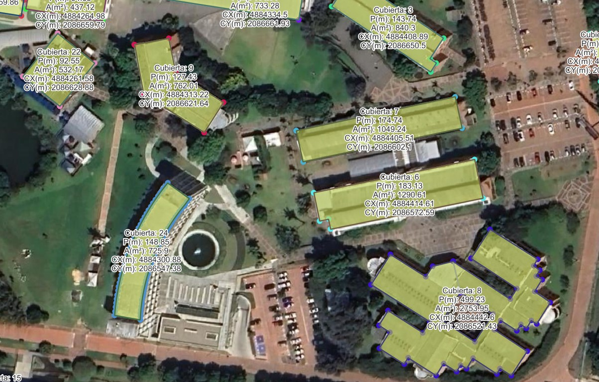

## Objetivos

Al finalizar esta actividad, el estudiante:

* Comprende el uso de las bases de datos en SIG.
* Realiza ejercicios prácticos en los que define y edita elementos de un SIG.
* Crea y edita tablas relacionales.

## Requerimientos

Archivos, actividades previas, lecturas y herramientas requeridas para el desarrollo de esta actividad:

| Requerimiento                                                                     | Descripción                                                                        |
|:----------------------------------------------------------------------------------|:-----------------------------------------------------------------------------------|
| [:toolbox:Herramienta](https://qgis.org/)                                         | QGIS 3.44 o superior.                                                              |  
| [:date:TSIG_CubiertaNodoUECIJG.csv](../../file/table/TSIG_CubiertaNodoUECIJG.csv) | Tabla con geo-localizadores de nodos para generación de áreas útiles por cubierta. |

> Para los diferentes avances de proyecto, es necesario guardar y publicar las diferentes versiones generadas del (los) libro (s) de Microsoft Excel, reportes o informes y dibujos generados, agregando al final la fecha de control documental en formato aaaammdd, p. ej., _M01A01_20250710.dwg_.

## 1. Creación de nodos de cubiertas

A partir del archivo [TSIG_CubiertaNodoUECIJG.csv](../../file/table/TSIG_CubiertaNodoUECIJG.csv) y utilizando el CRS 9377, cree la capa geográfica de puntos. 

1. En QGIS, cree un proyecto nuevo en blanco con el nombre _/map/M02A02b.qgz_, asigne el CRS 9377 y desde el menú _Layer / Add Layer / Add Delimited Text Layer..._, cree la capa temporal de localización geográfica de puntos de cubierta.

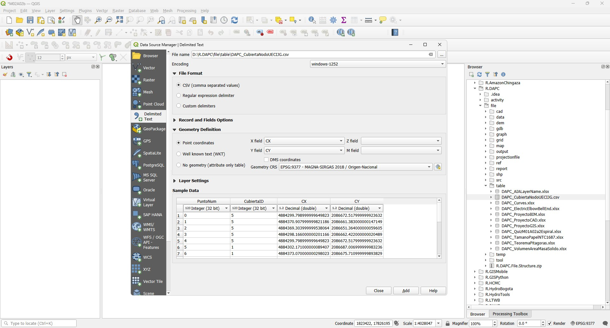

2. Agregue el mapa base XYZ de Google Satellite desde la dirección: https://mt1.google.com/vt/lyrs=s&x={x}&y={y}&z={z}

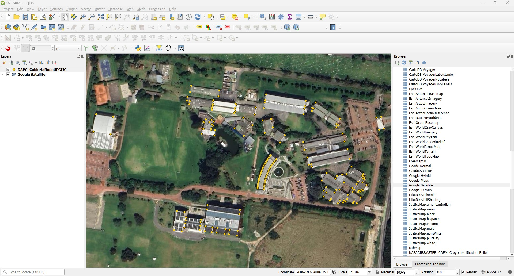

3. Desde la tabla de contenido, exporte la capa temporal a un archivo shapefile como _/shp/TSIG_CubiertaNodoUECIJG.shp_. Luego remueva la capa temporal.

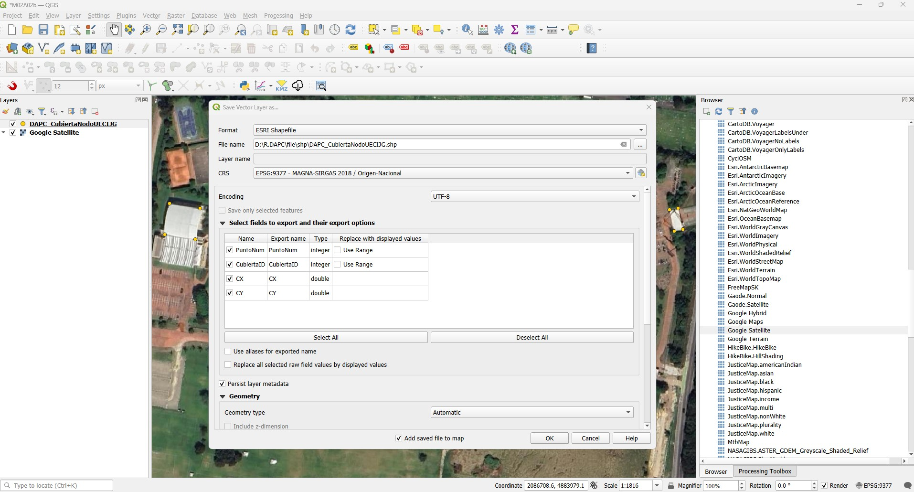

4. Simbolice por categorías a partir del código de la cubierta `CubiertaID` y rotule con la expresión `"CubiertaID" ||  '- '   ||  "PuntoNum"`. Abra la tabla de atributos de la capa, observará que existen 24 grupos o zonas de cubierta y 259 nodos.

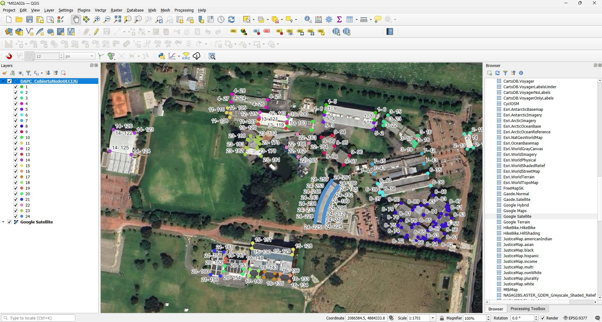

5. Para los puntos de cubierta, calcule la localización expresada en latitud y longitud en grados decimales a partir del sistema de proyección de coordenadas 4326.

* Los campos LatDD y LonDD se crean con tipo Real y se deben calcular para todos los nodos.
* Calcular usando 10 dígitos decimales y rotular con 6 decimales, usar la expresión 
* LonDD: `x(transform($geometry, layer_property(@layer, 'crs'),'EPSG:4326'))`
* LatDD: `y(transform($geometry, layer_property(@layer, 'crs'),'EPSG:4326'))`

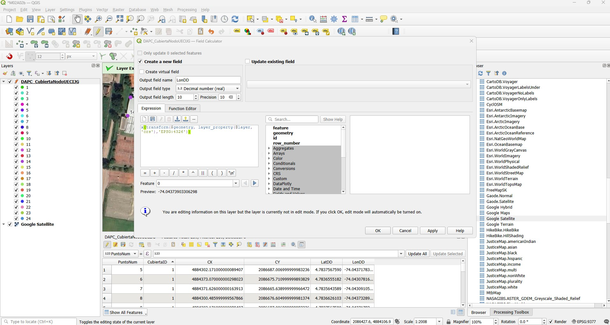

6. Cree un campo de texto de 255 caracteres que le permita localizar cada punto de cubierta en Google Maps. Detenga la edición de la tabla y con la tecla <kbd>CTRL</kbd>, de clic en cualquier link de la tabla para verificar su funcionamiento.

* GoogleMaps: `'http://maps.google.com/maps?q=' || "LatDD" || ',' || "LonDD"`

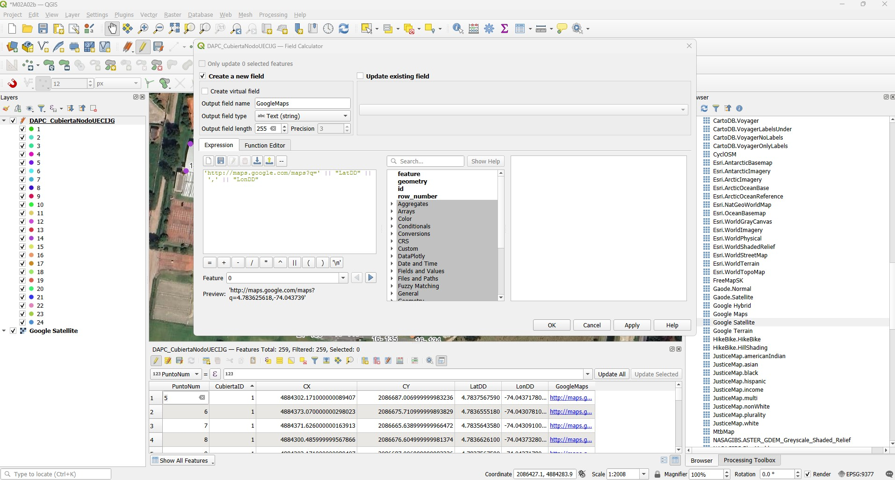

## 2. Creación de líneas perimetrales de cubiertas

A partir de los nodos de cubierta, cree las líneas perimetrales de cada cubierta.

1. Utilizando la herramienta _Processing Toolbox / Vector creation / Point to path_, cree la capa de líneas y guarde como _/shp/TSIG_CubiertaLineaUECIJG.shp_.

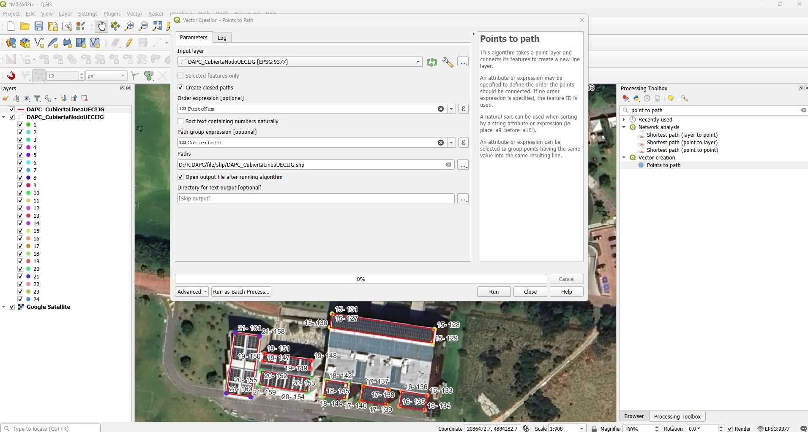

2. Simbolice por categorías a partir del código de la cubierta `CubiertaID` y rotule con la expresión `'Cubierta: ' || "CubiertaID"`. Abra la tabla de atributos de la capa, observará que existen 24 líneas perimetrales.

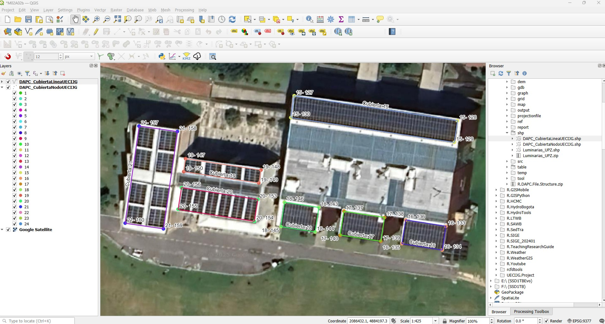

3. En un campo de atributos numérico real de precisión 10, calcule la longitud planar de las líneas perimetrales, nombre el campo como `LPm`. Expresión: `length(@geometry)`.

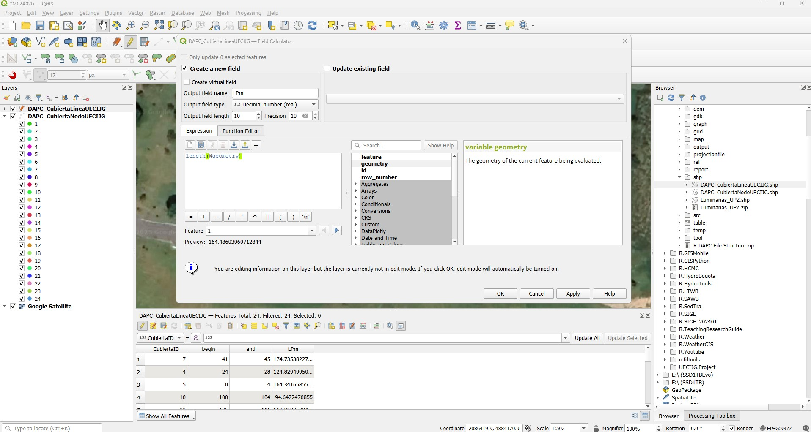

En el rótulo incluya en un nuevo renglón, la longitud redondeada a dos decimales con la expresión `'Cubierta: ' || "CubiertaID" || '\nP(m): ' || round( "LPm" , 2)`. 

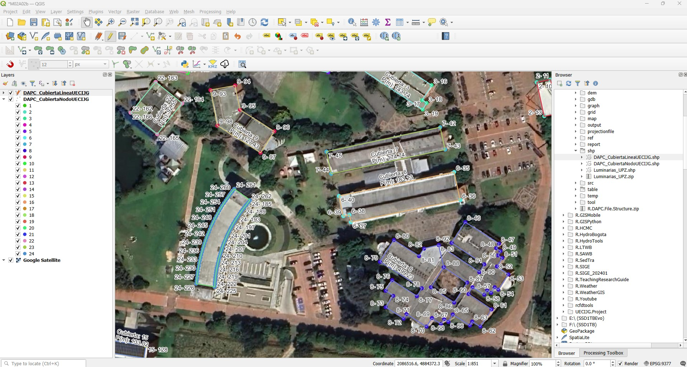

## 3. Polígonos de cubiertas

A partir de las líneas perimetrales, cree los polígonos de las cubiertas.

1. Utilizando la herramienta _Processing Toolbox / Vector creation / Polygonize_, cree la capa de polígonos y guarde como _/shp/TSIG_CubiertaPoligonoUECIJG.shp_.

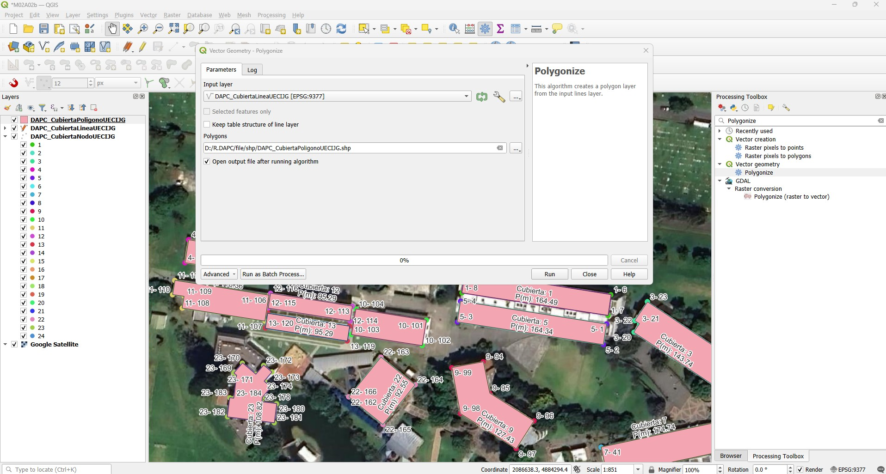

2. Ubique la cubierta del _Bloque C_ y elimine el polígono que delimita el patio interno. Abra la tabla de atributos, podrá observar que el proceso de conversión de líneas a polígonos no incluye los atributos correspondientes al código de cada cubierta.

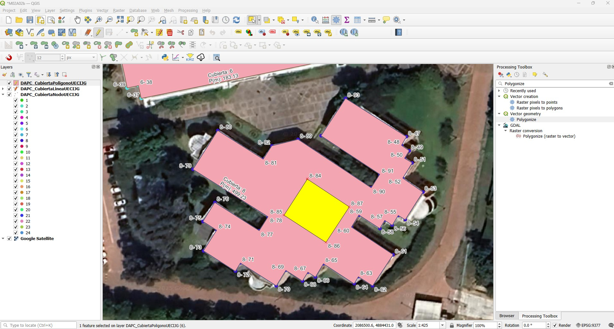

3. Utilizando la herramienta _Processing Toolbox / Vector general / Join attributes by nearest_, una los atributos de las líneas a la capa de cubiertas, nombre como _/shp/TSIG_CubiertaPoligono1UECIJG.shp_. Remueva del mapa la capa previa de polígonos.

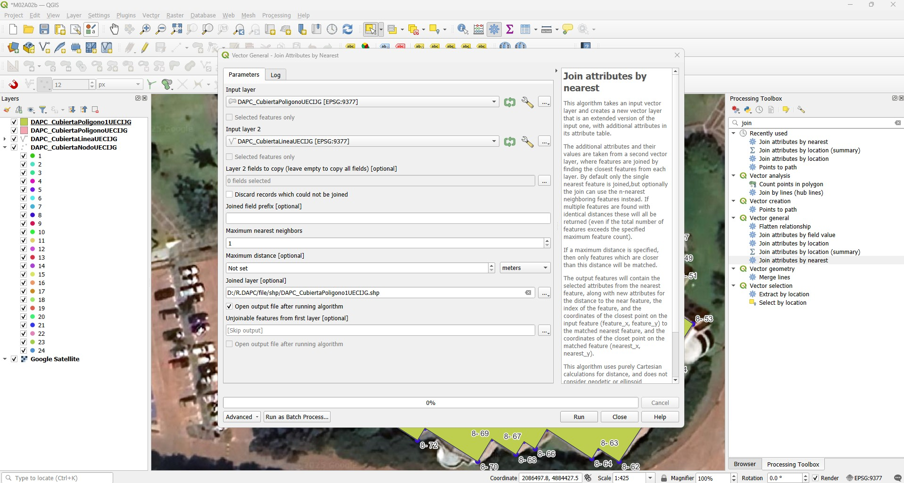

4. Desde el calculador de campo y con la expresión `area(@geometry)`, calcule en área planar `APm2` de cada polígono, calcule también el perímetro planar `PPm` y las coordenadas planas en metros del centroide `CX` y `CY`, rotule con la expresión `'Cubierta: ' || "CubiertaID" || '\nP(m): ' || round( "LPm" , 2) || '\nA(m²): ' || round( "APm2" , 2) || '\nCX(m): ' || round( "CX" , 2) || '\nCY(m): ' || round( "CY" , 2)`.

Expresiones:

* LPm = `length(@geometry)`
* APm2 = `area(@geometry)`
* CX = `x(@geometry)`
* CY = `y(@geometry)`

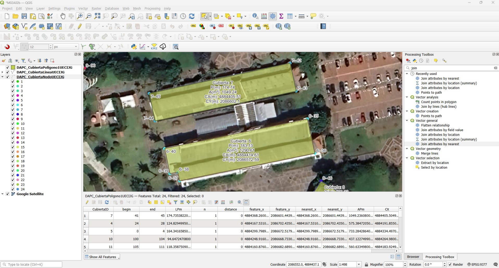

## 4. Área usable, número de paneles, potencial fotovoltáico y costos

En la tabla de atributos de la capa _TSIG_CubiertaPoligono1UECIJG.shp_, crear y calcular los siguientes campos de atributos:

| Campo | Tipo         | Descripción                                                                                                                                                                                                                                                  |
|:------|:-------------|:-------------------------------------------------------------------------------------------------------------------------------------------------------------------------------------------------------------------------------------------------------------|
| A     | Real (10)    | Área usable: utilizar el 90% del área disponible en cada polígono de cubierta `A = APm2 * 0.9`.                                                                                                                                                             |
| B     | Long Integer | Número de páneles: `B = Entero(AreaUsable / ((AnchoPanelenmilimetros * AltoPanelenmilimetros) / (1000 * 1000)))`. Tamaño de cada panel: 1950 x 992 milímetros. QGIS: `floor("A"/((1950*992)/(1000*1000)))`. Investigar y justificar el tamaño de cada panel. |
| C     | Real (10)    | Potencial de Kilovatios producidos por hora (Kwh): `C = B * Potencia Panel / 1000`. Potencia por panel: 330 watts-hora. Investigar y justificar la potencia por panel.                                                                                       |
| D     | Real (10)    | Real de Kilovatios producidos por hora (Kwh): `D = C / Factor Pérdida`.  Factor de Perdida: 1.43. Investigar y justificar el factor de pérdida.                                                                                                              |
| E     | Real (10)    | Costo instalación completa en millones de pesos:  `E = D * CostoInstKwatt / 1000000`. Costo por kilowatt instalado: $27,500,000 (no incluye instalación de pasarelas o líneas de vida, pararrayos y obras civiles).                                          |
| F     | Real (10)    | Potencial de Kilovatios producidos por dia para las horas de sol efectivas (Kwh - dia): `F = C * HorasEfectivasSolDia`.  Horas efectivas de sol al día: 5 hr/día. Investigar y justificar el número de horas efectivas de sol en Bogotá D.C.                 |
| G     | Real (10)    | Real Kilovatios producidos por dia (Kwh - dia): `G = F / Factor Pérdida`.                                                                                                                                                                                    |

## Referencias

* https://www.energy.gov/eere/solar/homeowners-guide-going-solar
* https://en.wikipedia.org/wiki/Photovoltaics
* [Aladdin: Engineering Design Enhanced by AI](https://intofuture.org/aladdin.html)
* https://institute-for-future-intelligence.github.io/aladdin/

## Control de versiones

| Versión    | Descripción        | Autor                                      | Horas |
|------------|:-------------------|--------------------------------------------|:-----:|
| 2025.09.10 | Versión inicial.   | [rcfdtools](https://github.com/rcfdtools)  |   8   |

##

_R.TSIG es de uso libre para fines académicos, conoce nuestra licencia, cláusulas, condiciones de uso y como referenciar los contenidos publicados en este repositorio, dando [clic aquí](../../LICENSE.md)._

_¡Encontraste útil este repositorio!, apoya su difusión marcando este repositorio con una ⭐ o síguenos dando clic en el botón Follow de [rcfdtools](https://github.com/rcfdtools) en GitHub._

| [:house: Inicio](../../README.md) | [:beginner: Ayuda / Colabora](https://github.com/rcfdtools/R.TSIG/discussions/1) |
|-----------------------------------|----------------------------------------------------------------------------------|

[^1]: 