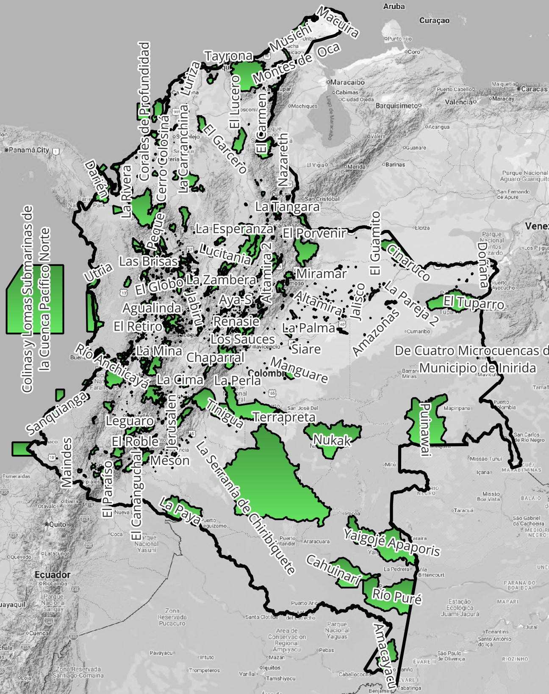

# Análisis de Parques Naturales Nacionales - PNN de Colombia

Reportes presentados por estudiantes del curso [TSIG y PYAS](https://github.com/rcfdtools/R.TSIG/blob/main/README.md).

| Parque Nacional                       | Categoría                  | Reporte                                                                                                                                                 |
|---------------------------------------|----------------------------|---------------------------------------------------------------------------------------------------------------------------------------------------------|
| Los Flamencos                         | Santuario de Fauna y Flora | [1000003213](1000003213_LosFlamencos.pdf), [1000100713](1000100713_LosFlamencos.pdf), [1000105543](1000105543_LosFlamencos.pdf)                         |
| El Corchal El Mono Hernández          | Santuario de Fauna y Flora | [1000110810](1000110810_ElCorchal.pdf), [1000106970](1000106970_ElCorchal.pdf)                                                                          |
| Selva de Florencia                    | Parque Nacional Natural    | [1000106805](1000106805_SelvaDeFlorencia.pdf),[1000101025](1000101025_SelvaDeFlorencia.pdf)                                                             |
| Guanentá Alto Río Fonce               | Santuario de Fauna y Flora | [1000111337](1000111337_GuanentaAltoRíoFonce.pdf), [1000106927](1000106927_GuanentaAltoRíoFonce.pdf), [1000115747](1000115747_GuanentaAltoRíoFonce.pdf) |
| Macuira                               | Parque Nacional Natural    | [1000102818](1000102818_Macuira.pdf), [1000104768](1000104768_Macuira.pdf)                                                                              |
| Iguaque                               | Santuario de Fauna y Flora | [1000106431](1000106431_Iguaque.pdf), [1000098341](1000098341_Iguaque.pdf)                                                                              |
| Plantas Medicinales Orito - Ingi Ande | Santuario de Flora         | [1000046376](1000046376_PlantasMedicinalesOrito.pdf), [1000046376]([1000106816](1000106816_PlantasMedicinalesOrito.pdf))                                |
| Galeras                               | Santuario de Fauna y Flora | [1000053954](1000053954_Galeras.pdf)                                                                                                                    |
| Las Orquídeas                         | Parque Nacional Natural    | [1000045159](1000045159_LasOrquideas.pdf)                                                                                                               |

